# PRD — DigiVoting: Sistem Pemilihan Digital Berbasis QR Token

| Atribut | Nilai |
|---|---|
| Versi | **1.1** — dokumentasi atas produk yang sudah dibangun (menggantikan v1.0 yang berfungsi sebagai fondasi) |
| Tanggal | 26 November 2026 |
| Basis kode | Repositori `otherveo/evoting`, cabang `main`, commit `f01eaba` (26 November 2026, "Split SuaraSekolah stylesheets by feature") |
| Nama produk | **DigiVoting** (sebelumnya "E-Voting"; nama teknis `evoting` pada schema, role, dan konfigurasi tetap) |
| Sumber kebenaran | `discussion.md` (rujukan `D§n`); keputusan pemilik produk (`KP-xxx`, termasuk `AMANDEMEN-PRD.md`); **kode sumber** untuk perilaku yang sudah berjalan |
| Dokumen pendamping | `BLUEPRINT.md` (arsitektur dan implementasi apa adanya), `schema.sql`, `DEPLOY.md`, `docs/update-v1.md` – `docs/update-v5.md` (catatan perubahan) |
| Bahasa | Indonesia |

> **Posisi dokumen.** PRD v1.0 ditulis sebelum aplikasi ada. Aplikasi kini berjalan, jadi dokumen ini **mendokumentasikan produk sebagaimana terbangun**. Bila implementasi memilih jalan yang berbeda dari rencana v1.0, PRD mengikuti implementasi dan perubahannya dicatat di 2.7 (`CH`). Bila implementasi belum memenuhi suatu aturan, aturan itu **tetap tertulis** dan kekurangannya dicatat di Bagian 4 dan di `BLUEPRINT.md` Bagian 4 (`GAP`).
>
> **Cara status ditentukan.** Status implementasi disimpulkan dengan **membaca kode** pada commit di atas. Aplikasi tidak dijalankan dan rangkaian tes tidak dieksekusi untuk menyusun dokumen ini. Bila `README.md` atau catatan lain bertentangan dengan kode, kodelah yang dipakai (pertentangan dicatat di `GAP-004`).

### Ringkasan perubahan v1.0 → v1.1

| Sumber | Perubahan |
|---|---|
| Amandemen PRD (`KP-009`) | TOTP hanya untuk Admin: `FR-001`, `FR-002`, `FR-007`, `BR-022`, `NFR-001`, `WF-002`, `WF-003` |
| Implementasi awal (`KP-010` – `KP-012`) | Foto, visi, misi paslon; Mode QR oleh Admin; hosting AWS; zona waktu WITA |
| `docs/update-v1` – `update-v4` (`KP-013` – `KP-016`, `KP-019` – `KP-021`) | Rebranding DigiVoting; persetujuan perangkat bersama; wizard pembuatan pemilihan; hapus pemilihan; batas hak pilih 3–10.000; pagination monitor; kunci tombol dan idempotensi |
| `docs/update-v1` §7 dan `update-v5` (`KP-017`, `KP-018`) | Access Key rekap langsung; kunci dan animasi rekap Operator; gerbang baca visi-misi. **Kebijakan "hasil tidak tampil sebelum Waktu Selesai" dilonggarkan** (`BR-026` berubah) |
| Hardening 21–22 November (`KP-022`, `KP-023`) | Dua login basis data (pemilih/publik dan staf), pemeriksaan Operator aktif di dalam fungsi, penjaga Nama Kembar dan idempotensi registrasi di basis data, otorisasi diperbarui pada setiap permintaan Livewire, sesi staf berversi, proxy tepercaya dikonfigurasi; pemutaran rekap Animasi dipisah dari pengaturannya dan ada tipe **Balapan** (`CH-009`, `FR-013`, `FR-034`, `FR-039`) |
| Update v7 (24–25 November) | Batas penggunaan perangkat dan blokir manual oleh Admin (`KP-025`); gerbang visi-misi dicabut (`CH-012`) |
| Update v8 dan pengerasan keamanan (25–26 November) | Batas perangkat juga untuk simulasi dan penolakan QR ketiga saat dibuka (`KP-027`); pengerasan permintaan web dan log peristiwa keamanan berantai hash (`KP-028`, `NFR-017`) |
| Dokumen | Bagian 4: status implementasi per kebutuhan |

### Riwayat perubahan

| Tanggal | Commit | Perubahan | Dampak pada PRD |
|---|---|---|---|
| 17 November | `AMANDEMEN-PRD.md` | TOTP hanya Admin | `KP-009`, `CH-003` |
| 18–21 November | `docs/update-v1` – `update-v5` | Rebranding, persetujuan perangkat, wizard, hapus pemilihan, Access Key, rekap berkunci dan animasi, gerbang visi-misi | `KP-013` – `KP-021`, `FR-034` – `FR-041` |
| 21–22 November | `4bd8985`, `1073087`, `d64d652`, `77719fb` | Pengerasan otorisasi dan basis data; pemutaran rekap dipisah, tipe Balapan | `KP-022`, `KP-023`, `CH-009`, `FR-013`, `FR-034`, `FR-039` |
| 22–23 November | `6e062bd`, `3871641` | **Daftar Paslon Publik** (`/paslon` dan `/{election}/paslon`); Operator dapat menampilkan atau menyembunyikan foto paslon di daftar publik; visi-misi paslon dipindah ke dialog; penyempurnaan kontrol Operator dan landing | `KP-024`, `CH-010`, `FR-042`, `BR-039`, `UI-024`, `AC-053`, `OD-014` terjawab sebagian |
| 23 November | `fac2b91` | **Gerbang baca visi-misi dicabut**: Pemilih tidak lagi wajib membuka visi-misi tiap paslon sebelum lanjut; tombol Lihat Visi & Misi tetap ada; perbaikan bug popup halaman Operator | `CH-012`, `FR-040` dan `BR-037` dicabut, `FR-017`, `NFR-012`, `WF-005`, `AC-019`, `AC-051` |
| 24–25 November | `7b9e110`, `6783d96`, `5f58566`, `c0079d3` | **Update v7 — batas penggunaan perangkat**: satu perangkat maksimal dua pemilih berbeda per pemilihan; Admin dapat memblokir manual dan membuka blokir; halaman Admin **Penggunaan Perangkat**; tahap Pemilih "perangkat ditolak" | `KP-025`, `CH-011`, `CH-013`, `FR-043`, `FR-044`, `BR-040`, `BR-041`, `UI-025`, `UI-026`, `AC-054` – `AC-056`, `OD-018` |
| 25 November | `00c83ef` | **Update v8 — batas perangkat diperluas:** berlaku juga untuk pemilihan simulasi (cutoff per pemilihan); QR ketiga ditolak saat dibuka tanpa menambah hitungan; Operator penerbit melihat banner dan label merah **Batas perangkat tercapai** | `KP-027`, `CH-014`, `FR-023`, `FR-043`, `BR-040`, `AC-054`, `OD-018` |
| 25–26 November | `bff3fa1`, `9b1e73f`, `ec2569d` | **Audit dan pengerasan keamanan web:** pemeriksaan Origin, daftar putih parameter permintaan, CSP (mode laporan) dan HSTS, pemulihan IP klien Cloudflare, log peristiwa keamanan berantai hash dan perintah verifikasinya, CI keamanan, dokumen audit dan daftar periksa staging | `KP-028`, `NFR-003`, `NFR-004`, `NFR-017` |
| 26 November | `6cec566`, `4e31fb2`, `f01eaba` | Pemulihan monitor Livewire dan umpan balik permintaan yang dibatalkan; validasi origin lokal; dokumentasi penerusan HTTPS lewat tunnel | `FR-023`, `FR-031` |

---

# 1. Cara Membaca Dokumen

## 1.1 Struktur

| Bagian | Isi |
|---|---|
| 1 | Konvensi, notasi, penelusuran |
| 2 | Latar belakang, tujuan, ruang lingkup, aktor, keputusan, glosarium |
| 3.1 – 3.2 | Kebutuhan fungsional (`FR`): **apa** yang dilakukan sistem |
| 3.3 | Relasi kebutuhan |
| 3.4 | Kebutuhan non-fungsional (`NFR`) |
| 3.5 | Workflow (`WF`) |
| 3.6 | UI/UX konseptual (`UI`) |
| 3.7 | Aturan bisnis (`BR`) |
| 3.8 | Kriteria penerimaan (`AC`) |
| 4 | Status implementasi per kebutuhan |

Hierarki: **Keputusan (`D§`, `KP`) → Aturan bisnis (`BR`) → Kebutuhan (`FR`, `NFR`) → Workflow (`WF`) dan UI (`UI`) → Kriteria penerimaan (`AC`)**. PRD menjelaskan *apa* dan *mengapa*; *bagaimana* ada di `BLUEPRINT.md`.

## 1.2 Konvensi penomoran

Format `PREFIX-NNN` (tiga digit). Nomor tidak berubah antarversi dan tidak diberikan ulang.

| Prefix | Arti | Bagian |
|---|---|---|
| `ACT` | Aktor | 2.6 |
| `KP` | Keputusan pemilik produk | 2.7 |
| `CH` | Perubahan terhadap `discussion.md` atau PRD v1.0 | 2.7 |
| `OD` | Keputusan terbuka | 2.8 |
| `FR` / `NFR` | Kebutuhan fungsional / non-fungsional | 3.1–3.2 / 3.4 |
| `WF` / `UI` | Workflow / halaman | 3.5 / 3.6 |
| `BR` / `AC` | Aturan bisnis / kriteria penerimaan | 3.7 / 3.8 |

`MOD`, `DB`, `API`, `VAL`, `SEC`, `TC`, `PRM`, `GAP` hanya didefinisikan di `BLUEPRINT.md`; PRD hanya merujuk `GAP` pada Bagian 4.

## 1.3 Notasi

| Notasi | Arti |
|---|---|
| **Disepakati** | Berasal dari `discussion.md`, `KP`, atau keputusan eksplisit pemilik produk. Mengikat. |
| **Rekomendasi** | Usulan yang diperlukan agar kebutuhan berjalan, **belum disepakati eksplisit**. Bila sudah berjalan di implementasi, tercatat di Bagian 4; menunggu konfirmasi. |
| **Terbuka** | Keputusan belum ada (2.8). |
| **P1 / P2** | P1 = tanpa ini pemilihan tidak dapat berjalan benar dan aman. P2 = diperlukan untuk operasi, audit, pemulihan, atau kenyamanan. |
| `` `Belum memilih` `` | Monospasi menandai nama status, tombol, atau istilah resmi yang ditulis persis. |
| `D§n` | `discussion.md` bagian ke-n. |

## 1.4 Menelusuri hubungan

Setiap baris `FR`/`NFR`/`BR` memuat **Dasar**; 3.3 memuat matriks `FR` ↔ aktor ↔ `WF` ↔ `BR` ↔ `NFR` ↔ `UI`; setiap `AC` menyebut `FR`/`BR` yang diuji; `BLUEPRINT.md` 3.17 melanjutkan ke modul, tabel, endpoint, validator, dan tes.

---

# 2. Penjelasan Awal

## 2.1 Latar belakang

Sekolah menyelenggarakan pemilihan (misalnya pemilihan ketua organisasi) secara digital agar cepat, tertib, dan dapat dipertanggungjawabkan. Peserta tidak memiliki akun permanen dan tidak seluruhnya memiliki perangkat sendiri; tidak ada kewajiban impor daftar pemilih atau integrasi dengan data sekolah `[D§1, D§2]`.

## 2.2 Permasalahan yang diselesaikan

| # | Masalah | Dampak bila tidak diselesaikan |
|---|---|---|
| 1 | Identitas pemilih harus dipastikan tanpa akun permanen | Orang tak berhak memilih |
| 2 | Satu orang memilih lebih dari sekali (QR dipindai ulang, banyak perangkat) | Hasil tidak sah |
| 3 | Kerahasiaan pilihan harus terjaga walau panitia mengelola data pemilih | Pilihan dapat ditelusuri |
| 4 | Proses voting dapat terputus | Pemilih terjebak |
| 5 | Perangkat dipakai bergantian | Peringatan palsu atau penolakan keliru bila perangkat dijadikan bukti identitas |
| 6 | Hasil dan partisipasi perlu transparan pada saat yang tepat | Kecurigaan, atau hasil bocor di tempat yang salah |
| 7 | Operator perlu bekerja cepat dan tanpa salah klik (tombol ganda, data ganda) | Pemilihan ganda, data sampah |

## 2.3 Tujuan

1. Setiap pemilih yang diverifikasi Operator memilih **tepat satu kali** per pemilihan.
2. Pilihan tidak dapat dihubungkan dengan identitas pemilih oleh pengguna aplikasi mana pun (Operator, Admin) `[BR-016]`.
3. Operator mandiri dari awal sampai akhir pemilihan `[KP-005]`.
4. Publik dapat melihat jumlah yang sudah memilih, dan hasil setelah masa pemilihan selesai `[KP-008]`.
5. Tindakan penting staf dapat diaudit `[D§6]`.

## 2.4 Ruang lingkup

**Dalam lingkup:** autentikasi dan akun staf; pemilihan, jadwal, paslon (foto, visi, misi); registrasi pemilih, QR, persetujuan perangkat bersama; voting; pemantauan; rekapitulasi dengan kunci dan animasi; halaman publik (jumlah pemilih, hasil); halaman rekap langsung dengan Access Key; hapus pemilihan; log audit; Mode QR; halaman beranda.

**Di luar lingkup:**

| Item | Alasan | Rujukan |
|---|---|---|
| Impor daftar pemilih, integrasi data sekolah | Tidak diwajibkan | `D§2` |
| Fitur khusus gelombang/urutan kelas | Dikelola panitia | `D§8` |
| Suara kosong / abstain | Pemilih memilih satu paslon | `D§3`, OD-011 |
| Pembatalan atau koreksi nama Hak Pilih yang salah daftar | Belum diputuskan | OD-009 |
| Indeks publik yang menautkan halaman Jumlah Pemilih dan Hasil | Belum diminta | OD-014 |
| Reset TOTP Admin lewat aplikasi | Dilakukan Pengelola Sistem | `KP-009` |
| Kode pemulihan TOTP, pemulihan kata sandi mandiri, email | Tidak ada layanan email | 2.5 |

## 2.5 Batasan

1. Tidak mengasumsikan setiap pemilih punya perangkat atau akun sendiri `[D§5]`.
2. Operator adalah validator identitas langsung `[D§1]`.
3. Data perangkat adalah indikator/audit `[D§5]`, bukan bukti identitas. Cookie dapat dihapus, browser diganti, IP dipakai bersama; pengenalan perangkat tidak dijamin unik. Perangkat bersama memicu **persetujuan Operator** (`BR-034`); sejak update v7 pemilih ketiga di satu perangkat **ditolak otomatis** dan Admin dapat memblokir perangkat (`BR-040`, `BR-041`, `CH-011`).
4. Keputusan validasi dilakukan di backend `[D§9]`.
5. Tidak ada integrasi sistem sekolah.

## 2.6 Aktor

| ID | Aktor | Akun | Tanggung jawab | Dasar |
|---|---|---|---|---|
| ACT-001 | **Admin** | Ya (kata sandi + TOTP) | Mengelola akun Operator (buat, aktif/nonaktif, reset kata sandi), mengatur Mode QR, meninjau Log Audit (baca saja), dan **melihat penggunaan perangkat serta memblokir/membuka blokir perangkat** per pemilihan. Tidak mengakses data pemilih (nama, status, pilihan) maupun hasil. | `KP-005`, `KP-006`, `KP-009`, `KP-025` |
| ACT-002 | **Operator** | Ya (kata sandi saja) | Mengelola mandiri seluruh pemilihan: pemilihan, jadwal, batas hak pilih, paslon, registrasi pemilih, QR, persetujuan perangkat bersama, penanganan QR dan sesi bermasalah, pemantauan, rekapitulasi, Access Key rekap langsung, hapus pemilihan. Tidak melihat pilihan per pemilih; tidak mengelola akun staf. | `D§1`, `D§2`, `KP-005`, `KP-009` |
| ACT-003 | **Pemilih** | Tidak (anonim) | Memindai QR, `Mulai memilih`, memilih satu paslon, `Konfirmasi pilihan`. | `D§1`, `D§3` |
| ACT-004 | **Publik** | Tidak (anonim, tanpa QR) | Membuka halaman jumlah pemilih, halaman hasil (setelah selesai), dan halaman rekap langsung bila memegang Access Key. | `KP-008`, `KP-017` |
| ACT-005 | **Pengelola Sistem** | Di luar aplikasi | CLI `seed:admin` / `seed:operator`, reset TOTP Admin, basis data, penyebaran. | `KP-006`, `KP-009` |

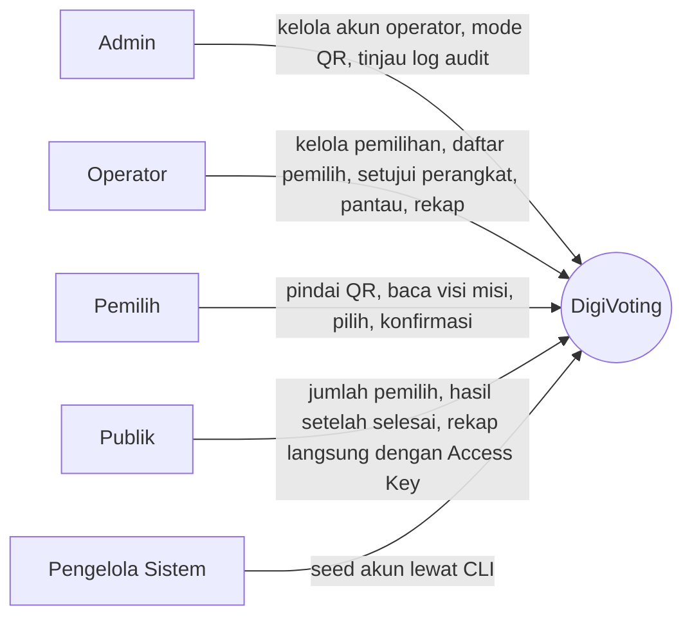
```mermaid
flowchart LR
  ADM["Admin"] -->|"kelola akun operator, mode QR, tinjau log audit"| SYS(("DigiVoting"))
  OPR["Operator"] -->|"kelola pemilihan, daftar pemilih, setujui perangkat, pantau, rekap"| SYS
  PMH["Pemilih"] -->|"pindai QR, baca visi misi, pilih, konfirmasi"| SYS
  PUB["Publik"] -->|"jumlah pemilih, hasil setelah selesai, rekap langsung dengan Access Key"| SYS
  PGS["Pengelola Sistem"] -->|"seed akun lewat CLI"| SYS
```

## 2.7 Keputusan yang telah ditetapkan

### Keputusan pemilik produk (`KP`)

| ID | Keputusan | Sumber |
|---|---|---|
| KP-001 | Basis: **Laravel + Supabase**. | Tanya-jawab |
| KP-002 | Supabase hanya PostgreSQL terkelola (ditambah Storage untuk foto paslon); autentikasi di Laravel. | Tanya-jawab, `KP-010` |
| KP-003 | Blade + Livewire. Halaman Operator memperbarui diri tiap **3 detik**; halaman lain refresh manual. Interval dan halaman real-time dapat diubah. | Tanya-jawab |
| KP-004 | Sesi Memilih 10 menit; lanjut di browser yang sama; Operator dapat Reset Sesi. | Tanya-jawab |
| KP-005 | Aktor: Admin (terbatas), Operator (mandiri), Pemilih (anonim). Batas hak pilih ditetapkan Operator. | Tanya-jawab |
| KP-006 | Akun admin lewat CLI `seed:admin`; operator lewat `seed:operator` atau Admin di aplikasi. | Tanya-jawab |
| KP-007 | Masa pemilihan dapat diatur sampai ketelitian menit. | Permintaan lanjutan |
| KP-008 | Dua halaman publik: jumlah pemilih yang sudah memilih; halaman yang terbuka setelah masa pemilihan selesai. | Permintaan lanjutan |
| KP-009 | **TOTP hanya untuk Admin.** | `AMANDEMEN-PRD.md` |
| KP-010 | Paslon dapat memiliki **foto** (bucket Supabase Storage `paslon-foto`), **visi**, dan **misi**. | `schema.sql`, `README.md` |
| KP-011 | Penyebaran: AWS Ubuntu, PHP 8.4, Nginx/PHP-FPM, Supabase. | `DEPLOY.md` |
| KP-012 | Zona waktu tampilan dan input jadwal: Asia/Makassar; penyimpanan UTC. | `.env.example` |
| KP-013 | **Rebranding** nama yang terlihat pengguna menjadi **DigiVoting**; identitas teknis tidak diubah. | `update-v1` Perubahan 4 |
| KP-014 | **Persetujuan perangkat bersama:** Pemilih yang memakai browser yang sudah dipakai Hak Pilih lain menunggu persetujuan **Operator penerbit QR**. | `update-v1` §3.2, `update-v2` |
| KP-015 | **Wizard pembuatan pemilihan** 4 langkah dengan keadaan di sisi klien; keluar setelah langkah 1 terisi menyimpan **draft**; keluar saat langkah 1 kosong membatalkan. | `update-v1` §2.2, `update-v4` |
| KP-016 | **Hapus pemilihan** hanya pada Fase `Persiapan` atau `Ditutup`, dengan konfirmasi mengetik nama. | `update-v1` Perubahan 6 |
| KP-017 | **Access Key rekap langsung:** satu kunci aktif per pemilihan, 64 karakter, hash di basis data, tampil sekali; halaman terpisah dari halaman publik, hanya baca, dengan banner peringatan merah. Kebijakan ini **sengaja** membuka hasil sebelum waktunya atas permintaan klien. | `update-v1` Perubahan 7 |
| KP-018 | **Kebijakan privasi tampilan hasil dilepas**; akses hasil diatur Operator: Rekapitulasi terkunci sampai kuota hak suara penuh atau pemilihan berakhir, lalu dibuka/ditutup bebas oleh Operator; ada mode animasi reveal; ~~Pemilih wajib membuka visi-misi setiap paslon sebelum lanjut~~ (dicabut `KP-026`). Anonimitas data suara tidak berubah. | `update-v5` |
| KP-019 | Batas maksimum hak pilih: **3 sampai 10.000**. | `update-v1` Perubahan 1 |
| KP-020 | Pemantauan Operator dipaginasi **25 baris**; pembaruan otomatis hanya di halaman 1 dan dijeda saat panel terbuka. | `update-v4` Bagian A |
| KP-021 | Setiap tombol terkunci saat ditekan dan menampilkan popup hasil 1–2 kata; pengaman server mencegah data ganda. | `update-v1` Bug 1 |
| KP-022 | **Pengerasan otorisasi dan basis data:** dua login basis data berhak minimum (`evoting_app` untuk Pemilih dan halaman publik, `evoting_staff` untuk operasi staf); fungsi staf yang mengubah data memeriksa Operator aktif; registrasi idempoten dan Nama Kembar dijaga di basis data; setiap permintaan Livewire halaman staf memeriksa ulang akses; sesi staf berversi; proxy tepercaya dikonfigurasi lewat `TRUSTED_PROXIES`. | Kode dan commit 21–22 November (`4bd8985`, `1073087`) |
| KP-023 | Mode **Animasi** pada Rekapitulasi dipisah menjadi pengaturan dan pemutaran, dengan dua tipe: **Reveal Bertahap** dan **Balapan** (manual atau otomatis). | Kode dan commit 21–22 November (`d64d652`, `77719fb`) |

| KP-024 | **Daftar Paslon Publik:** halaman tanpa login yang menampilkan paslon (nomor, nama, foto, visi, misi) untuk pemilihan yang sudah berjadwal dan memiliki paslon; pemilihan bernama pelatihan/simulasi/tes tidak dicantumkan; Operator dapat menampilkan atau menyembunyikan foto tiap paslon di daftar publik. | Kode dan commit 22–23 November (`6e062bd`, `3871641`) |
| KP-025 | **Batas penggunaan perangkat (update v7):** satu perangkat (Pengenal Browser) hanya boleh dipakai **dua pemilih berbeda per pemilihan**; pemilih ketiga ditolak. Admin dapat memblokir manual perangkat yang sudah dipakai dua kali pada suatu pemilihan, dan membuka blokirnya. Pemilihan bernama pelatihan/simulasi/tes tidak dihitung; penggunaan sebelum penanda mulai berlaku tidak dihitung. | Kode dan commit 24–25 November (`7b9e110`, `5f58566`) |
| KP-026 | **Gerbang baca visi-misi dicabut** (mengubah `KP-018`). | Kode dan commit 23 November (`fac2b91`) |
| KP-027 | **Update v8 — batas perangkat:** batas dua penggunaan berlaku untuk pemilihan resmi **dan simulasi**; dihitung saat tautan QR sah dibuka (refresh QR yang sama = satu penggunaan); penggunaan kedua memerlukan persetujuan Operator penerbit; QR ketiga ditolak saat dibuka tanpa menambah hitungan, membuka sesi, atau mengajukan persetujuan; pemilihan resmi memakai cutoff v7, simulasi yang sudah ada dibekukan saat v8 diaktifkan; Operator penerbit melihat peringatan merah. Filter perangkat Admin tetap mengecualikan simulasi. | `docs/update-v8.md`, commit `00c83ef` |
| KP-028 | **Pengerasan keamanan web:** pemeriksaan Origin, daftar putih bentuk parameter permintaan, CSP (mode laporan) dan HSTS, pemulihan IP klien dari Cloudflare, log peristiwa keamanan berantai hash, CI keamanan, audit keamanan November 2026. | `docs/security/*`, commit `bff3fa1`, `9b1e73f` |

### Perubahan (`CH`)

| ID | Perubahan | Alasan |
|---|---|---|
| CH-001 | `D§8` menyebut Admin menetapkan batas hak pilih → kini **Operator**. | `KP-005` |
| CH-002 | `D§1`/`D§6` hanya menyebut Operator dan Pemilih → kini juga Admin (terbatas) dan Publik. | `KP-005`, `KP-008` |
| CH-003 | PRD v1.0: seluruh akun staf memakai TOTP → kini **hanya Admin**. | `KP-009` |
| CH-004 | PRD v1.0: foto dan visi-misi paslon di luar MVP → kini **dalam lingkup**. | `KP-010` |
| CH-005 | PRD v1.0 `BR-026`: hasil per paslon tidak tampil kepada siapa pun sebelum Waktu Selesai → kini ada **dua jalur terkendali** sebelum Waktu Selesai (Rekapitulasi Operator dan Rekap Langsung dengan Access Key). Hasil di **halaman publik** tetap hanya setelah Waktu Selesai. | `KP-017`, `KP-018` |
| CH-006 | PRD v1.0 `BR-015`: perangkat bersama hanya diberi peringatan → kini **menunggu persetujuan Operator penerbit QR**. | `KP-014` |
| CH-007 | PRD v1.0: alur Pemilih 3 aksi → kini ada tahap Konfirmasi dan gerbang baca visi-misi. | `KP-018` |
| CH-008 | PRD v1.0 `BR-020`/`NFR-008`: Log Audit dan Suara tidak dapat dihapus → pada **penghapusan pemilihan**, Suara dan entri audit yang terkait pemilihan itu ikut terhapus (perilaku implementasi). Instruksi `update-v1` Perubahan 6 butir 6 menyatakan audit *tidak* ikut dihapus; implementasi berbeda (`OD-016`, `GAP-003`). | Temuan kode |

| CH-009 | PRD v1.0 `BR-034` (draf awal): Hak Pilih lama tanpa penerbit QR dapat diputuskan Operator mana pun. Implementasi terbaru: **tidak ada Operator yang dapat memutuskan** permintaan pada Hak Pilih tanpa penerbit; jalan keluarnya Terbitkan Ulang QR (yang mengisi penerbit). | Kode `fn_decide_device_approval` (`KP-022`). |

| CH-010 | PRD v1.0 `OD-014` / lingkup: tidak ada indeks publik pemilihan → kini ada **Daftar Paslon Publik** yang juga berfungsi sebagai indeks pemilihan berjadwal dan berpaslon (tanpa batasan Fase). Halaman Jumlah Pemilih dan Hasil tetap per pemilihan. | `KP-024`. |
| CH-011 | `D§5`/`BR-015`: "data perangkat hanya indikator, bukan dasar penolakan" → update v7 menjadikan Pengenal Browser dasar **penolakan otomatis** (pemilih ketiga di satu perangkat) dan **blokir manual Admin**. Implementasi mengikuti v7; `BR-015` diubah. | `KP-025`; risiko pada perangkat bersama: `OD-018`. |
| CH-012 | `KP-018`: Pemilih wajib membuka visi-misi tiap paslon → **dicabut** (`FR-040`, `BR-037`). | `KP-026`. |
| CH-013 | `ACT-001`: Admin hanya mengelola akun → kini juga **memblokir perangkat** dan melihat **Penggunaan Perangkat** (`FR-043`, `FR-044`); tetap tidak melihat data pemilih. | `KP-025`. |
| CH-014 | `KP-025` (v7): batas dua penggunaan tidak menghitung pemilihan bernama pelatihan/simulasi/tes → v8: **dihitung juga**; ditambah penolakan QR ketiga saat dibuka dan peringatan merah Operator. | `KP-027`. |

## 2.8 Keputusan terbuka (`OD`)

| ID | Keputusan | Status per 21 November 2026 | Dampak |
|---|---|---|---|
| OD-001 | Target performa dan ukuran maksimum | **Terbuka.** Batas atas hak pilih 10.000 per pemilihan (`KP-019`); tidak ada target waktu respons | `NFR-011` |
| OD-002 | Target ketersediaan | **Terbuka.** Titik kesehatan `/up` tersedia; pemantau uptime belum ditetapkan | `NFR-010` |
| OD-003 | Kedaluwarsa Token QR berbasis waktu | **Terjawab:** tidak ada; token berlaku sampai Hak Pilih `Sudah memilih`, diterbitkan ulang, atau ditolak lewat persetujuan perangkat | `FR-014`, `FR-029` |
| OD-004 | Retensi data perangkat dan log | **Terbuka.** Tidak ada penghapusan otomatis | `NFR-006` |
| OD-005 | Hasil sebelum Waktu Selesai | **Terjawab oleh `KP-017`/`KP-018`:** lihat `BR-026` | `BR-026` |
| OD-006 | Penafsiran `KP-007`/`KP-008` | **Diimplementasikan; menunggu konfirmasi:** (a) jadwal menggantikan buka/tutup manual, dengan pintasan **Mulai sekarang** dan **Akhiri Pemilihan Sekarang**; (b) halaman publik kedua = hasil per paslon; (c) Waktu Selesai batas keras tanpa masa tenggang; (d) halaman jumlah pemilih = satu angka | `FR-009`, `FR-010`, `FR-021`, `FR-022` |
| OD-007 | Minimum paslon untuk jadwal | **Terjawab:** 2 | `BR-024` |
| OD-008 | Peninjau Log Audit | **Terjawab:** Admin, baca saja | `FR-027` |
| OD-009 | Koreksi Hak Pilih salah daftar | **Terbuka.** Tidak ada pembatalan atau pengubahan nama; Operator dapat Terbitkan Ulang QR | `BR-003` |
| OD-010 | Region dan pemantau uptime | **Sebagian terjawab** (`KP-011`); region dan pemantau belum ditetapkan | — |
| OD-011 | Suara kosong | **Terbuka.** Tidak ada. (Foto/visi/misi: terjawab, `KP-010`) | `FR-018` |
| OD-012 | Parameter keamanan akun | **Terjawab oleh implementasi:** kata sandi minimal 8 karakter; 5 percobaan gagal per 60 detik per username+IP (juga untuk TOTP); idle sesi mengikuti `SESSION_LIFETIME` (contoh 30 menit) | `FR-001`, `FR-003` |
| OD-013 | Zona waktu | **Terjawab** (`KP-012`) | `FR-009` |
| OD-014 | Indeks publik seluruh pemilihan | **Sebagian terjawab (`KP-024`):** ada Daftar Paslon Publik yang mendaftar pemilihan berjadwal dan berpaslon (dengan penyaring nama pelatihan/simulasi/tes). Belum ada indeks yang menautkan Jumlah Pemilih dan Hasil | — |
| OD-015 | Kebijakan kata sandi final | **Terbuka.** Kode: minimal 8, tanpa aturan kompleksitas. `README.md` masih menyebut minimal 10 dengan kombinasi karakter (`GAP-004`) | `FR-002` |
| OD-016 | Penghapusan jejak audit dan suara saat hapus pemilihan | **Terbuka.** Implementasi menghapusnya (`CH-008`); instruksi `update-v1` menyatakan audit dipertahankan | `BR-020`, `BR-036`, `NFR-008` |
| OD-017 | Penguatan penegakan aturan di basis data | **Sebagian terjawab (`KP-022`):** Operator aktif, Nama Kembar, idempotensi registrasi, dan gerbang rekap kini di fungsi basis data. **Masih terbuka:** penguncian paslon ke Fase `Persiapan`, batas hak pilih ≥ jumlah Hak Pilih, dan kebijakan hapus pemilihan (`GAP-003`, `GAP-006`) | `NFR-004`, `NFR-007` |
| OD-018 | Kecocokan batas dua penggunaan per perangkat dengan perangkat bersama milik panitia (mis. satu tablet atau komputer laboratorium dipakai banyak pemilih) | **Terbuka.** Implementasi menolak pemilih ketiga tanpa pengecualian (kini juga pada simulasi); perangkat bersama yang disediakan panitia dapat terkunci setelah dua pemilih; jalan keluarnya perangkat lain atau Admin tidak dapat memberi pengecualian. Lihat `D§5` dan `CH-011` | `FR-043`, `BR-029`, `BR-040` |

## 2.9 Glosarium

| Istilah resmi | Definisi |
|---|---|
| Pemilihan | Satu penyelenggaraan pemungutan suara (nama, jadwal, paslon, batas hak pilih). |
| Jadwal Pemilihan | **Waktu Mulai** dan **Waktu Selesai**, ketelitian menit (`KP-007`). |
| Fase Pemilihan | Diturunkan dari jadwal: `Persiapan` (jadwal belum diatur atau belum mulai), `Berlangsung` (mulai ≤ sekarang < selesai), `Ditutup` (sekarang ≥ selesai). Bukan Status Hak Pilih. |
| Paslon | Pasangan calon: nomor urut, nama, foto, visi, misi. |
| Pemilih | Orang yang memilih; anonim. |
| Hak Pilih | Satu record hak suara satu pemilih dalam satu pemilihan. |
| Status Hak Pilih | `Belum memilih`, `Sedang memilih`, `Sudah memilih`. |
| Token QR / QR | Token acak sekali pakai dalam URL pada QR; tidak memuat nama atau pilihan. |
| Sesi Memilih | Sejak `Mulai memilih` sampai konfirmasi atau reset; **10 menit**. |
| Sesi Kedaluwarsa | **Indikator** (bukan status): Hak Pilih `Sedang memilih` yang batas 10 menitnya lewat. |
| Pengenal Browser | Nilai acak di cookie `evoting_browser_id` (HttpOnly, SameSite Lax, 30 hari); dipakai untuk Sesi Memilih dan Peringatan Perangkat. |
| Perangkat | Browser yang dikenali lewat Pengenal Browser. Bukan identitas seseorang. |
| Peringatan Perangkat | Indikator bahwa Hak Pilih diakses dari Perangkat yang juga pernah mengakses Hak Pilih **lain** pada pemilihan yang sama (simetris). |
| Persetujuan Perangkat Bersama | Gerbang yang menahan Pemilih di Perangkat bersama sampai Operator penerbit QR menyetujui atau menolak. Status persetujuan: `tidak_perlu`, `menunggu`, `disetujui`, `ditolak`. |
| Suara | Satu pilihan paslon, anonim, tanpa tautan ke Hak Pilih. |
| Rekapitulasi | Penjumlahan Suara per paslon. |
| Kunci Rekapitulasi | Keadaan terbuka/tertutup halaman Rekapitulasi Operator (`FR-038`). |
| Reveal | Mode animasi tampil hasil per paslon pada Rekapitulasi (`FR-039`). |
| Access Key | Kunci 64 karakter untuk Halaman Rekap Langsung; satu aktif per pemilihan (`FR-037`). |
| Penggunaan Perangkat | Jumlah **Hak Pilih berbeda** yang membuka tautan QR di satu perangkat (Pengenal Browser) pada satu pemilihan sejak penanda v7; batas 2 (`FR-043`) |
| Blokir Perangkat | Penolakan manual oleh Admin atas satu perangkat pada satu pemilihan (`FR-044`) |
| Tipe Balapan | Varian mode Animasi pada Rekapitulasi: suara paslon bertambah satu demi satu dalam bentuk balapan, dimainkan manual (satu suara per klik) atau otomatis dengan jeda 20–10.000 ms |
| Rekap Langsung | Halaman hasil real-time per paslon yang hanya terbuka dengan Access Key. |
| Draft Pemilihan | Pemilihan biasa pada Fase `Persiapan` dengan data belum lengkap; bukan status khusus. |
| Log Audit | Catatan tindakan penting. |
| Akun Staf | Akun Admin atau Operator. |
| 2FA / TOTP | Kode 6 digit berbasis waktu dari aplikasi autentikator; **hanya Admin**. |
| Nama Kembar | Dua nama yang sama setelah huruf dikecilkan dan spasi dirapatkan. |
| Reset Sesi / Terbitkan Ulang QR | Tindakan Operator (`FR-030` / `FR-029`). |
| Mode QR | Pengaturan Admin: **Kustom** (logo sekolah, koreksi galat H) atau **Standar** (polos, M). |
| Halaman Jumlah Pemilih / Halaman Hasil | Dua halaman publik (`FR-021` / `FR-022`). |

## 2.10 Pemetaan `discussion.md` ke PRD

| `D§` | Keputusan | Diakomodasi |
|---|---|---|
| 1 | QR token sekali pakai; tanpa akun; Operator validator | `FR-014`, `FR-015`, `BR-001`, `BR-002`, `BR-012` |
| 2 | Registrasi oleh Operator; status awal; nama terkunci; Nama Kembar; tanpa impor | `FR-012`, `FR-013`, `BR-003` – `BR-006` |
| 3 | Alur QR → Mulai → Sedang → Konfirmasi → Sudah; URL acak | `FR-015` – `FR-018`, `BR-010`, `BR-012` |
| 4 | Tiga status; validasi backend; atomik; satu transaksi | `FR-019`, `BR-007` – `BR-009` |
| 5 | Pencatatan perangkat; peringatan; hanya indikator; perangkat bersama boleh | `FR-024`, `FR-025`, `FR-034`, `BR-015`, `BR-029`, `BR-034` |
| 6 | Operator berwenang; autentikasi kuat; audit; hak akses terbatas | `FR-001`, `FR-002`, `FR-004`, `FR-026`, `BR-020` – `BR-022` |
| 7 | Identitas dipisah dari pilihan; Operator tidak lihat pilihan | `BR-016`, `BR-017`, `NFR-005`, `NFR-006` |
| 8 | Batas hak pilih; tolak setelah tercapai; suara ≤ hak pilih | `FR-028`, `FR-032`, `BR-018`, `BR-019` |
| 9 | Validasi backend; token acak/dapat dicabut; satu token satu suara | `BR-030`, `FR-016`, `FR-018`, `FR-029`, `BR-010` |

---

# 3. Isi Utama

## 3.1 Kebutuhan Fungsional Utama

### Autentikasi dan akses staf

| ID | Kebutuhan | Aktor | Alasan | P | Status | Dasar |
|---|---|---|---|---|---|---|
| FR-001 | **Login akun staf.** Admin: username + kata sandi, lalu kode TOTP. Operator: username + kata sandi saja. Pesan gagal tidak membedakan username salah dan kata sandi salah; percobaan gagal beruntun dibatasi. Kolom kata sandi dapat ditampilkan/disembunyikan. | Admin, Operator | Hanya staf berwenang mengelola akun dan hak pilih; faktor kedua hanya Admin karena kehilangan autentikator Operator di tengah pemilihan menghentikan operasi | P1 | Disepakati | `D§6`, `KP-009` |
| FR-002 | **Aktivasi akun pertama.** Admin yang baru dibuat/direset wajib mengganti kata sandi sementara dan mengaktifkan TOTP; Operator wajib mengganti kata sandi sementara saja. | Admin, Operator | Kata sandi sementara diketahui pihak lain | P1 | Disepakati | `D§6`, `KP-006`, `KP-009` |
| FR-003 | **Logout dan kedaluwarsa sesi.** Sesi berakhir saat keluar atau idle melebihi `SESSION_LIFETIME`. Akun nonaktif ditolak pada permintaan berikutnya. | Admin, Operator | Mencegah sesi tertinggal | P1 | Disepakati (OD-012) | `D§6` |
| FR-004 | **Otorisasi berbasis peran.** Admin hanya fitur akun, Mode QR, Log Audit; Operator hanya fitur pemilihan; Pemilih hanya halaman QR-nya; Publik hanya halaman publik dan Rekap Langsung. | Semua | Hak akses sesuai tugas | P1 | Disepakati | `D§6`, `KP-005` |
| FR-005 | **Membuat akun Operator** (username, nama lengkap); kata sandi sementara tampil sekali. | Admin | Satu-satunya jalur membuat Operator lewat aplikasi | P1 | Disepakati | `KP-005`, `KP-006` |
| FR-006 | **Aktif/nonaktifkan akun Operator.** Akun nonaktif ditolak pada permintaan berikutnya; akun tidak dihapus agar jejak audit utuh. | Admin | Mencabut akses | P1 | Disepakati | `KP-005` |
| FR-007 | **Reset kata sandi Operator** (kata sandi sementara baru, tampil sekali; wajib diganti). Reset TOTP tidak berlaku untuk Operator; TOTP Admin yang hilang direset Pengelola Sistem. | Admin | Operator lupa kata sandi tidak boleh menghentikan pemilihan | P2 | Disepakati | `KP-005`, `KP-009` |

### Pemilihan dan paslon

| ID | Kebutuhan | Aktor | Alasan | P | Status | Dasar |
|---|---|---|---|---|---|---|
| FR-008 | **Membuat dan mengubah pemilihan.** Nama 3–160 karakter; batas maksimum hak pilih 3–10.000 dan tidak boleh di bawah jumlah Hak Pilih yang sudah dibuat. Pembuatan lewat wizard (`FR-035`). | Operator | Wadah paslon, pemilih, hasil | P1 | Disepakati | `D§8`, `KP-005`, `KP-019` |
| FR-009 | **Mengatur Jadwal Pemilihan.** Waktu Mulai dan Waktu Selesai sampai menit (zona `KP-012`, disimpan UTC). Aturan: selesai > mulai; jadwal baru tidak boleh sudah berakhir; paslon minimal 2; saat `Berlangsung` Waktu Mulai terkunci tetapi Waktu Selesai boleh diperpanjang/dimajukan; setelah `Ditutup` tidak dapat diubah. Pintasan: **Mulai sekarang** (Fase `Persiapan`) dan **Akhiri Pemilihan Sekarang** (Fase `Berlangsung`, modal konfirmasi). | Operator | Masa pemilihan terbatas dan terkontrol | P1 | Disepakati (adanya jadwal); aturan rinci = Rekomendasi (OD-006) | `KP-007` |
| FR-010 | **Penegakan Fase Pemilihan.** Fase diturunkan otomatis dari jadwal. Hak Pilih hanya dibuat, serta `Mulai memilih` dan `Konfirmasi pilihan` hanya diterima, pada `Berlangsung`. | Sistem | Mencegah suara di luar masa pemilihan | P1 | Rekomendasi (OD-006) | `KP-007`, `D§9` |
| FR-011 | **Mengelola paslon** pada Fase `Persiapan`: nomor urut (1–99, unik), nama (2–160), foto (opsional; JPG/PNG/WEBP ≤ 2 MB), visi (opsional ≤ 600 karakter), misi (opsional; satu butir per baris, ≤ 2000 karakter). | Operator | Pemilih memilih dari daftar sah dengan informasi cukup | P1 | Disepakati | `D§3`, `KP-010` |
| FR-035 | **Wizard pembuatan pemilihan** (Identitas → Paslon → Jadwal → Tautan). Keadaan wizard di sisi klien; tidak ada yang tertulis ke server sebelum konfirmasi akhir, kecuali **draft**. Tombol "Saya ingin melengkapinya nanti" tidak ada di langkah 1 dan menyimpan draft di langkah 2–4. Keluar (Batal, X, Escape, klik latar) saat langkah 1 **kosong** membatalkan; saat langkah 1 **terisi** menyimpan draft lalu membuka halaman detail pemilihan. Langkah Paslon mensyaratkan minimal 2 paslon untuk lanjut; langkah Jadwal menyediakan **Mulai sekarang** opsional dengan konfirmasi tambahan. | Operator | Mengarahkan Operator memenuhi syarat jadwal tanpa kebingungan, tanpa data setengah jadi yang tak disengaja | P2 | Disepakati | `KP-015` |
| FR-036 | **Hapus pemilihan.** Hanya Fase `Persiapan` atau `Ditutup`; ditolak saat `Berlangsung`. Operator mengetik nama pemilihan persis; penghapusan permanen dan menghapus paslon (beserta foto), Hak Pilih, Suara, log akses perangkat, dan entri audit yang terkait pemilihan itu; QR yang sudah terbit tidak berlaku lagi. | Operator | Membersihkan pemilihan uji yang tidak dipakai | P2 | Disepakati (aturan fase dan konfirmasi); penghapusan Suara dan audit = implementasi (`CH-008`, OD-016) | `KP-016` |

### Registrasi pemilih dan QR

| ID | Kebutuhan | Aktor | Alasan | P | Status | Dasar |
|---|---|---|---|---|---|---|
| FR-012 | **Registrasi pemilih oleh Operator.** Setelah memverifikasi identitas langsung, Operator memasukkan nama lengkap (2–140 karakter). Sistem membuat satu Hak Pilih `Belum memilih`, mencatat Operator penerbit, dan menerbitkan QR. | Operator | Operator adalah validator identitas | P1 | Disepakati | `D§1`, `D§2` |
| FR-013 | **Penguncian nama dan Nama Kembar.** Bila nama (setelah normalisasi) sudah terdaftar, sistem menampilkan Hak Pilih yang ada dan Operator wajib mencentang bahwa semuanya orang berbeda sebelum Hak Pilih terpisah dibuat. **Basis data menolak** registrasi bila jumlah kecocokan nama yang dikonfirmasi Operator tidak sama dengan jumlah kecocokan sebenarnya, dan menjawab "sudah diproses" bila permintaan dengan pengenal yang sama diulang (klik ganda). | Operator | Mencegah dobel registrasi tanpa melarang dua orang bernama sama | P1 | Disepakati | `D§2`, `KP-022` |
| FR-014 | **Penerbitan QR.** QR dan tautan teks (dapat disalin) ditampilkan sekali; Token QR tidak dapat ditampilkan lagi. Tampilan mengikuti Mode QR (`FR-033`). | Operator | Jalur akses sekali pakai | P1 | Disepakati | `D§2`, `D§3`, `D§9` |

### Proses voting

| ID | Kebutuhan | Aktor | Alasan | P | Status | Dasar |
|---|---|---|---|---|---|---|
| FR-015 | **Akses halaman voting lewat QR.** Pemindaian membuka halaman sesuai Status Hak Pilih dan Fase (`UI-014` – `UI-017`); tidak menampilkan nama pemilih. | Pemilih | Satu pintu tanpa akun | P1 | Disepakati | `D§3` |
| FR-016 | **Mulai memilih.** Memvalidasi token, Fase `Berlangsung`, dan status `Belum memilih`; mengubah status menjadi `Sedang memilih` secara atomik; membuat Sesi Memilih 10 menit terikat browser. | Pemilih | Mencegah sesi ganda dan dobel suara | P1 | Disepakati | `D§3`, `D§4`, `KP-004` |
| FR-017 | **Memilih paslon.** Kartu paslon menampilkan nomor, nama, foto; tombol **Pilih Paslon Ini** (atau ketuk kartu) memilih tepat satu; tombol **Lihat Visi & Misi** membuka visi dan misi. Pilihan belum tersimpan di basis data. | Pemilih | Satu pemilih, satu pilihan, informasi cukup | P1 | Disepakati | `D§3`, `KP-010` |
| FR-040 | **Gerbang baca visi-misi — DICABUT.** Pada commit `fac2b91` Pemilih tidak lagi wajib membuka visi-misi setiap paslon; `Lanjut ke Konfirmasi` hanya mensyaratkan satu paslon terpilih. Tombol **Lihat Visi & Misi** tetap tersedia sebagai pilihan. ID tidak dipakai ulang. | Pemilih | Gerbang dianggap menghambat | — | Dicabut | `KP-026`, `CH-012` |
| FR-018 | **Konfirmasi pilihan dan penyimpanan suara.** Tahap Konfirmasi menampilkan paslon terpilih (dapat kembali memilih ulang). `Konfirmasi pilihan` memastikan status `Sedang memilih`, sesi masih berlaku dan milik browser yang sama, Fase `Berlangsung`, persetujuan perangkat (bila perlu) sudah ada, dan paslon milik pemilihan itu; lalu menyimpan Suara anonim dan mengubah status menjadi `Sudah memilih` dalam **satu transaksi**. Permintaan ulang tidak menambah Suara. | Pemilih | Satu token, satu suara | P1 | Disepakati | `D§3`, `D§4`, `D§9` |
| FR-019 | **Pengelolaan Status Hak Pilih.** Tiga status dan hanya transisi pada `BR-007`; divalidasi di backend. | Sistem | Mencegah status tidak sah | P1 | Disepakati | `D§4`, `D§9` |
| FR-034 | **Persetujuan Perangkat Bersama.** Saat `Mulai memilih`, bila browser yang sama sudah mengakses Hak Pilih lain di pemilihan itu dan belum disetujui, status menjadi `Sedang memilih` dengan persetujuan `menunggu`; halaman Pemilih terkunci "Menunggu persetujuan operator" (memeriksa otomatis tiap 3 detik dan lewat tombol **Cek izin**, hanya dari browser yang memulai sesi). Popup muncul di halaman pemantauan **hanya untuk Operator penerbit QR**. **Setujui** → Pemilih lanjut; **Tolak** → sesi berakhir, QR dicabut, Pemilih diberi pesan menolak dan harus meminta QR baru. Tanpa keputusan dalam 10 menit, sesi dikembalikan ke awal. Hak Pilih tanpa penerbit tercatat tidak dapat diputuskan siapa pun (`CH-009`); Terbitkan Ulang QR mengisi penerbit. Keputusan dicatat di Log Audit. | Pemilih, Operator | Perangkat bersama harus dibuktikan wajar oleh Operator sebelum memilih | P1 | Disepakati | `KP-014`, `D§5`, `KP-022` |

### Rekapitulasi dan halaman publik

| ID | Kebutuhan | Aktor | Alasan | P | Status | Dasar |
|---|---|---|---|---|---|---|
| FR-020 | **Rekapitulasi Operator.** Setelah Kunci Rekapitulasi dibuka (`FR-038`), Operator melihat Suara per paslon, total, persentase, dan hasil pemeriksaan integritas (`FR-032`); mode tampilan `FR-039`. Integritas dapat dilihat tanpa membuka kunci. | Operator | Mengesahkan hasil dan menemukan anomali | P1 | Disepakati | `D§7`, `D§8`, `KP-018` |
| FR-038 | **Kunci Rekapitulasi.** Halaman rekap default **terkunci**. Dapat dibuka Operator bila **seluruh kuota hak suara terpakai** (jumlah `Sudah memilih` ≥ batas maksimum) **atau** Fase `Ditutup`. Setelah syarat terpenuhi Operator bebas membuka/menutup; keadaan tersimpan dan sama bagi semua Operator. Kartu terkunci menjelaskan syarat. | Operator | Hasil tidak boleh terbuka tanpa kendali; tidak boleh terkunci permanen | P1 | Disepakati | `KP-018` |
| FR-039 | **Mode tampilan Rekapitulasi dan Animasi.** Operator memilih **Biasa** atau **Animasi**. Animasi memiliki dua tipe: **Reveal Bertahap** (urutan tampil manual atau **Acak Urutan Tampil**, jeda 20–10.000 ms sebagai durasi hitung-naik satu paslon; angka menghitung dari 0 lalu kartu bergerak ke peringkat, suara terbanyak di atas, badge "TERATAS", persentase 1 desimal) dan **Balapan** (suara bertambah satu demi satu: **Reveal Manual** satu suara per klik, atau **Reveal Otomatis** dengan jeda 20–10.000 ms yang dapat diubah saat berjalan). Pengaturan disimpan di sesi Operator lalu Operator diarahkan ke halaman pemutaran terpisah; data suara baru diambil saat pemutaran dimulai; `Esc` atau tombol tutup melewati hitungan paslon yang sedang tampil. Konfigurasi Reveal terkunci bagi Operator lain selama animasi berjalan dan dapat di-reset. | Operator | Penyajian hasil di depan khalayak | P2 | Disepakati | `KP-018`, `KP-023` |
| FR-021 | **Halaman publik Jumlah Pemilih.** Tanpa login; satu angka total Hak Pilih `Sudah memilih` (tanpa nama, tanpa rincian paslon), waktu pemuatan, tombol muat ulang manual; dapat dibuka kapan saja. | Publik | Transparansi partisipasi | P1 | Disepakati (OD-006d) | `KP-008` |
| FR-022 | **Halaman publik Hasil.** Hanya terbuka setelah Waktu Selesai; sebelum itu kartu "belum tersedia" dengan Waktu Selesai, **tanpa angka**. Sesudahnya: total Suara, Suara dan persentase per paslon (dengan foto), serta paslon teratas (semua bila seri). Tombol muat ulang manual. | Publik | Hasil tidak bocor sebelum waktunya | P1 | Disepakati (OD-006b) | `KP-008`, `BR-026` |
| FR-037 | **Access Key Rekap Langsung.** Operator menerbitkan **satu** Access Key aktif per pemilihan (64 karakter acak: huruf, angka, simbol), tampil **sekali**, dapat dicabut atau diterbitkan ulang (kunci lama otomatis tidak berlaku); hanya hash tersimpan. Halaman Rekap Langsung (path terpisah dari halaman publik, tanpa tautan dari halaman publik) meminta Access Key, lalu menampilkan hasil per paslon real-time (pembaruan tiap 3 detik), hanya baca, tanpa identitas pemilih, dengan **banner merah** peringatan yang selalu terlihat. Percobaan salah dibatasi. | Operator, Publik | Pihak berwenang (mis. kepala sekolah) ingin menonton progres; kebijakan dilonggarkan sengaja | P2 | Disepakati | `KP-017` |

## 3.2 Kebutuhan Fungsional Pendukung

| ID | Kebutuhan | Aktor | Alasan | P | Status | Dasar |
|---|---|---|---|---|---|---|
| FR-023 | **Monitoring aktivitas pemilih.** Ringkasan jumlah per Status Hak Pilih, jumlah yang perlu perhatian, status integritas, dan daftar Hak Pilih (25 per halaman; nama, status, waktu perubahan, indikator Sesi Kedaluwarsa dan Peringatan Perangkat, Perangkat bersama beserta anggotanya, status persetujuan) dengan pencarian nama dan filter status. Pembaruan otomatis **tiap 3 detik**, hanya di halaman 1, hanya saat tab terlihat, dijeda saat panel terbuka. Operator penerbit melihat banner dan label merah **Batas perangkat tercapai** pada pembaruan berikutnya bila Hak Pilih miliknya ditolak oleh batas perangkat; pembukaan yang berhasil pada browser lain membersihkan peringatan aktif (riwayat penolakan tetap di audit). Pilihan paslon tidak terlihat. | Operator | Operator perlu tahu siapa memilih dan siapa tertahan | P1 | Disepakati | `D§4`, `D§7`, `KP-003`, `KP-020` |
| FR-024 | **Pencatatan perangkat.** Setiap pembukaan QR, `Mulai memilih`, dan `Konfirmasi pilihan` dicatat dengan jenis akses, Pengenal Browser, User-Agent, IP, waktu. Waktu mulai dan Pengenal Browser Sesi Memilih tersimpan pada Hak Pilih. | Sistem | Bahan indikator dan audit | P2 | Disepakati | `D§5` |
| FR-025 | **Peringatan Perangkat.** Hak Pilih yang berbagi Perangkat dengan Hak Pilih lain (pemilihan yang sama) ditandai; panel detail menampilkan riwayat akses dan anggota Perangkat yang sama. Pengenalan hanya lewat Pengenal Browser; IP dan User-Agent hanya konteks. | Operator | Operator memverifikasi langsung | P2 | Disepakati | `D§5` |
| FR-026 | **Audit aktivitas.** Login (berhasil/gagal), logout, aktivasi dan perubahan kredensial, pengelolaan akun, Mode QR, pembuatan/perubahan/penghapusan pemilihan, jadwal, paslon, Hak Pilih, QR ulang, Reset Sesi, persetujuan perangkat, Access Key, serta `Mulai memilih` dan konfirmasi (tanpa isi pilihan). | Sistem | Akuntabilitas | P1 | Disepakati | `D§6` |
| FR-027 | **Peninjauan Log Audit.** Admin melihat (baca saja, 25 per halaman) dan memfilter menurut jenis aktor, aksi, dan kata kunci. | Admin | Audit butuh peninjau independen | P2 | Rekomendasi (OD-008) | `D§6` |
| FR-028 | **Batas maksimum hak pilih.** Pembuatan Hak Pilih ditolak setelah batas tercapai; batas tidak boleh turun di bawah jumlah Hak Pilih yang ada. | Operator, Sistem | Mencegah penerbitan berlebih | P1 | Disepakati | `D§8` |
| FR-029 | **Terbitkan Ulang QR.** Hanya saat `Belum memilih` dan Fase `Berlangsung`; alasan wajib (3–300 karakter); token lama dicabut dan dianggap tidak dikenal. | Operator | QR hilang atau disalahgunakan | P2 | Disepakati | `D§6`, `D§9` |
| FR-030 | **Reset Sesi Memilih.** `Sedang memilih` → `Belum memilih`, alasan wajib; Pemilih mengulang dari QR. | Operator | Pemilih tidak boleh terjebak | P1 | Disepakati | `KP-004` |
| FR-031 | **Umpan balik antarmuka dan pencegahan aksi ganda.** Setiap tombol terkunci segera saat ditekan (kursor tidak boleh, warna berubah) dan hanya aktif kembali bila aksi gagal; setiap aksi menampilkan popup 1–2 kata; pengaman server mencegah data ganda dari klik/permintaan berulang (kunci idempotensi sisi aplikasi, dan pengenal registrasi di basis data untuk pembuatan Hak Pilih); pesan galat menyebut penyebab tanpa detail teknis, dan galat basis data dicatat dengan nomor insiden. | Semua | Mencegah data ganda dan kebingungan | P2 | Disepakati | `KP-021`, `KP-022` |
| FR-032 | **Pemeriksaan integritas.** Jumlah Suara = jumlah `Sudah memilih` dan ≤ jumlah Hak Pilih; hasil ditampilkan kepada Operator. | Sistem, Operator | Mendeteksi manipulasi | P1 | Disepakati | `D§8` |
| FR-033 | **Pengaturan Mode QR** oleh Admin: **Kustom** atau **Standar**; berlaku untuk QR yang digambar sesudahnya, tidak mengubah isi token, dicatat di audit; pratinjau kedua mode. | Admin | Kendala pemindaian lapangan | P2 | Disepakati (implementasi) | — |
| FR-041 | **Halaman beranda.** Memperkenalkan DigiVoting dan alur penggunaan visual untuk Operator dan Pemilih, serta tautan masuk staf. | Semua | Orientasi pengguna | P2 | Disepakati | `KP-013`, `update-v1` Perubahan 5 |
| FR-042 | **Daftar Paslon Publik.** Siapa pun tanpa login dapat melihat daftar paslon (nomor, nama, foto, visi, misi) suatu pemilihan. Hanya pemilihan yang jadwalnya sudah diatur dan memiliki paslon yang tercantum; pemilihan yang namanya diawali kata pelatihan, simulasi, atau tes tidak dicantumkan. Bila hanya ada satu pemilihan tercantum, halaman indeks langsung mengarah ke daftarnya (parameter `pilih` memaksa tampil daftar pemilihan). Foto hanya tampil bila Operator mengizinkan (per paslon; bawaan tampil) dan perubahan itu dicatat di Log Audit. Tidak menampilkan data pemilih maupun hasil. | Publik, Operator | Pemilih dan publik dapat mengenal paslon sebelum memilih | P2 | Disepakati (implementasi) | `KP-024` |
| FR-043 | **Batas penggunaan perangkat.** Satu perangkat (Pengenal Browser) hanya boleh dipakai **dua Hak Pilih berbeda** pada satu pemilihan, **resmi maupun simulasi**. Batas dihitung saat tautan QR sah dibuka; membuka ulang token yang sama (refresh) tetap satu penggunaan. Penggunaan kedua memerlukan persetujuan Operator penerbit saat `Mulai memilih` (`FR-034`). **QR ketiga ditolak saat dibuka**: server tidak menambah hitungan, tidak membuka sesi, dan tidak mengajukan persetujuan; halaman penolakan (tanpa dialog atau tombol) menampilkan "Satu perangkat yang sama hanya diizinkan maksimal 2x digunakan". Pemeriksaan yang sama berlaku pada mulai memilih, pemeriksaan dan keputusan persetujuan, dan pengiriman suara. Token yang sama tetap dapat dibuka pada browser lain yang masih memiliki jatah. Hanya penggunaan sejak **cutoff** pemilihan yang dihitung: pemilihan resmi memakai cutoff v7; simulasi yang sudah ada saat v8 diaktifkan dibekukan saat penerapan skema; sesi sah sebelum cutoff boleh selesai dalam 10 menit. Penolakan dicatat di log perangkat dan Log Audit (aktor `sistem`). | Pemilih, Sistem | Mencegah satu perangkat dipakai memilih berulang-ulang | P1 | Disepakati (v7, v8); lihat `OD-018` | `KP-025`, `KP-027` |
| FR-044 | **Pengelolaan perangkat oleh Admin.** Halaman **Penggunaan Perangkat** menampilkan, per pemilihan, daftar perangkat (Pengenal Browser) dengan jumlah penggunaan, jumlah pembukaan, akses terakhir, User-Agent terakhir, dan status blokir (25 per halaman). Admin dapat **memblokir** perangkat yang sudah dipakai dua kali pada pemilihan itu (alasan opsional) dan **membuka blokir**. Daftar Admin mengecualikan pemilihan simulasi. Perangkat diblokir ditolak pada tautan, mulai, dan konfirmasi; blokir terhapus bersama pemilihannya. Aksi dicatat di Log Audit. | Admin | Menangani perangkat yang dicurigai disalahgunakan tanpa melibatkan data pemilih | P2 | Disepakati (v7) | `KP-025`, `CH-013` |

## 3.3 Relasi Kebutuhan

| FR | Aktor | WF | BR | NFR | UI |
|---|---|---|---|---|---|
| FR-001 | Admin, Operator | WF-003 | BR-021, BR-022 | NFR-001, NFR-003, NFR-004 | UI-001, UI-002 |
| FR-002 | Admin, Operator | WF-002, WF-003 | BR-022 | NFR-001 | UI-003 |
| FR-003 | Admin, Operator | WF-003 | BR-021 | NFR-003 | UI-001 |
| FR-004 | Semua | WF-003 | BR-021, BR-030 | NFR-004 | UI-020 |
| FR-005 – FR-007 | Admin | WF-002 | BR-021, BR-022 | NFR-001, NFR-014 | UI-004, UI-005 |
| FR-008 | Operator | WF-001 | BR-018, BR-021 | NFR-014 | UI-007, UI-008 |
| FR-009 | Operator | WF-001, WF-008 | BR-023 – BR-025, BR-032 | NFR-007, NFR-014 | UI-007, UI-008 |
| FR-010 | Sistem | WF-001, WF-004, WF-005, WF-008 | BR-023, BR-024, BR-030, BR-032 | NFR-007 | UI-014 – UI-017 |
| FR-011 | Operator | WF-001 | BR-011, BR-024 | NFR-014 | UI-007, UI-008 |
| FR-035 | Operator | WF-001 | BR-018, BR-024 | NFR-012 | UI-007 |
| FR-036 | Operator | WF-010 | BR-020, BR-036 | NFR-008, NFR-014 | UI-007, UI-008 |
| FR-012, FR-013 | Operator | WF-004 | BR-001, BR-003 – BR-006, BR-018, BR-023 | NFR-007, NFR-012, NFR-014 | UI-009, UI-010 |
| FR-014 | Operator | WF-004 | BR-002, BR-012, BR-028, BR-033 | NFR-002 | UI-011 |
| FR-015 | Pemilih | WF-005 | BR-002, BR-012, BR-028 | NFR-002, NFR-006, NFR-013 | UI-014 – UI-017 |
| FR-016 | Pemilih | WF-005 | BR-007, BR-008, BR-013, BR-023 | NFR-007, NFR-009 | UI-014 |
| FR-017 | Pemilih | WF-005 | BR-011 | NFR-012, NFR-013 | UI-015 |
| FR-018 | Pemilih | WF-005 | BR-009, BR-010, BR-016, BR-019, BR-023, BR-032 | NFR-005, NFR-007, NFR-009 | UI-015, UI-016 |
| FR-019 | Sistem | WF-005, WF-006 | BR-006 – BR-009, BR-030 | NFR-007 | UI-009, UI-012 |
| FR-034 | Pemilih, Operator | WF-009 | BR-015, BR-029, BR-034 | NFR-009, NFR-016 | UI-009, UI-012, UI-015, UI-023 |
| FR-020, FR-038, FR-039 | Operator | WF-008 | BR-017, BR-019, BR-026, BR-038 | NFR-005, NFR-007 | UI-013 |
| FR-021 | Publik | WF-008 | BR-016, BR-031 | NFR-006, NFR-013 | UI-018 |
| FR-022 | Publik | WF-008 | BR-016, BR-026, BR-032 | NFR-006, NFR-013 | UI-019 |
| FR-037 | Operator, Publik | WF-011 | BR-016, BR-026, BR-035 | NFR-005, NFR-006 | UI-008, UI-022 |
| FR-023 | Operator | WF-004, WF-006, WF-008, WF-009 | BR-017 | NFR-016 | UI-009 |
| FR-024, FR-025 | Sistem, Operator | WF-005, WF-009 | BR-015, BR-029 | NFR-006, NFR-014 | UI-009, UI-012 |
| FR-026 | Sistem | semua | BR-020 | NFR-008, NFR-014 | UI-006 |
| FR-027 | Admin | WF-002 | BR-020, BR-021 | NFR-014 | UI-006 |
| FR-028 | Operator, Sistem | WF-001, WF-004 | BR-018 | NFR-007 | UI-008, UI-010 |
| FR-029 | Operator | WF-007 | BR-012, BR-027 | NFR-002, NFR-014 | UI-011, UI-012 |
| FR-030 | Operator | WF-006 | BR-007, BR-013, BR-014 | NFR-009, NFR-014 | UI-012 |
| FR-031 | Semua | semua | — | NFR-012 | semua UI |
| FR-032 | Sistem, Operator | WF-008 | BR-019 | NFR-007, NFR-008 | UI-009, UI-013 |
| FR-033 | Admin | WF-004 | BR-033 | NFR-012 | UI-004 |
| FR-041 | Semua | — | — | NFR-012, NFR-013 | UI-021 |
| FR-042 | Publik, Operator | — | BR-016, BR-039 | NFR-006, NFR-013 | UI-008, UI-024 |
| FR-043 | Terimplementasi | Ditegakkan di `fn_open_qr`, `fn_start_voting`, `fn_confirm_vote`, `fn_check_device_approval`, dan keputusan persetujuan lewat `fn_device_session_gate`, dengan kunci advisory per pemilihan+perangkat dan cutoff per pemilihan. Tes: `test_device_limit_two_uses_per_election_and_admin_block` (`GAP-020`) |
| FR-044 | Terimplementasi | Halaman Admin `DeviceUsagePage` (kelas dasar `StaffPage`, peran `admin`); fungsi memeriksa Admin aktif |
| FR-043 | Pemilih, Sistem | WF-012 | BR-029, BR-040 | NFR-007 | UI-026 |
| FR-044 | Admin | WF-012 | BR-021, BR-041 | NFR-014 | UI-025 |

Hubungan penting: `FR-016`, `FR-018`, `FR-030`, `FR-029`, dan `FR-034` memakai satu mesin status (`FR-019`, `BR-007`); `FR-009` menentukan `FR-010`, yang menjadi prasyarat `FR-012`, `FR-016`, `FR-018`; `FR-021`, `FR-022`, `FR-037` hanya menampilkan data agregat dan bergantung pada pemisahan identitas dan Suara (`BR-016`).

## 3.4 Kebutuhan Non-Fungsional

Angka yang belum ditetapkan ditandai **[Perlu konfirmasi: OD-xxx]**.

| ID | Kategori | Kebutuhan | Indikator / kriteria penerimaan | Verifikasi | Status |
|---|---|---|---|---|---|
| NFR-001 | Security — autentikasi | Akun staf dilindungi kata sandi; Admin ditambah TOTP; percobaan beruntun dibatasi. | (1) Admin tanpa TOTP benar selalu ditolak. (2) Setelah 5 percobaan gagal dalam 60 detik per username+IP (OD-012), respons berikutnya ditolak sementara. (3) Admin dengan TOTP belum aktif hanya dapat mengakses `UI-003`. (4) Operator masuk tanpa TOTP (`KP-009`). | Uji skenario login dan otorisasi | Disepakati |
| NFR-002 | Security — token | Token QR tidak dapat ditebak dan tidak dapat dipakai ulang untuk suara kedua. | (1) Sumber acak kriptografis, ≥ 256 bit. (2) Hanya hash satu arah disimpan. (3) Token tidak memuat nama atau pilihan. | Tinjauan skema, uji integrasi | Disepakati |
| NFR-003 | Security — transport dan permintaan | Lalu lintas HTTPS; cookie tidak dapat dibaca skrip; halaman sensitif tidak di-cache; permintaan web diperiksa: Origin sama, bentuk parameter terdaftar (daftar putih), HSTS dan CSP (mode laporan). | (1) HTTP tidak melayani konten. (2) Cookie HttpOnly. (3) Halaman Pemilih, staf, auth, dan Rekap Langsung ber-`Cache-Control: no-store` dan `noindex`. (4) Permintaan dengan Origin asing atau parameter di luar daftar putih ditolak (mode `enforce`). (5) HSTS terkirim; CSP terkirim sebagai laporan. | Uji header dan uji permintaan | Disepakati/Rekomendasi |
| NFR-004 | Security — otorisasi | Keputusan hak akses dan validasi dilakukan di backend, dan fungsi basis data staf yang mengubah data memeriksa Operator aktif. | Untuk tiap (peran, fitur) pada `FR-004`, permintaan tak berhak ditolak walau frontend dimanipulasi; setiap permintaan Livewire pada halaman staf memeriksa ulang peran, keaktifan akun, dan versi sesi; login basis data Pemilih/publik tidak dapat mengelola staf atau membaca hasil Operator. | Uji otorisasi per peran | Disepakati (`D§9`, `KP-022`) |
| NFR-005 | Privacy — anonimitas | Tidak ada jalur data yang menghubungkan Hak Pilih dengan Suara. | (1) Tabel Suara tidak memiliki kolom atau relasi ke Hak Pilih, token, perangkat, atau akun. (2) Suara tidak memiliki waktu atau nomor urut. (3) Tidak ada layar atau log yang menampilkan pilihan per pemilih (termasuk Rekap Langsung dan animasi Reveal). | Tinjauan skema, uji privasi | Disepakati (`D§7`) |
| NFR-006 | Privacy — minimisasi | Setiap halaman menampilkan data seperlunya. | (1) Halaman Pemilih tanpa nama. (2) Halaman publik hanya agregat. (3) Operator hanya melihat status. (4) Retensi IP/User-Agent: **[Perlu konfirmasi: OD-004]**. | Uji tampilan | Disepakati; retensi terbuka |
| NFR-007 | Data integrity | Satu Hak Pilih menghasilkan paling banyak satu Suara; status dan Suara konsisten. | (1) Permintaan serentak pada satu token menghasilkan paling banyak satu Sesi Memilih dan satu Suara. (2) Jumlah Suara = jumlah `Sudah memilih`. | Uji konkurensi dan integritas | Disepakati |
| NFR-008 | Data integrity — jejak | Log Audit dan Suara tidak dapat diubah atau dihapus melalui aplikasi, **kecuali** sebagai bagian penghapusan satu pemilihan (`BR-036`). | UPDATE atas entri audit/Suara ditolak; DELETE ditolak di luar jalur penghapusan pemilihan. | Uji basis data | Disepakati; pengecualian = OD-016 |
| NFR-009 | Reliability | Proses terputus dapat dipulihkan tanpa kehilangan atau menggandakan suara. | (1) Setelah aplikasi dimulai ulang, sesi berjalan tetap dapat dilanjutkan dalam 10 menit. (2) Konfirmasi ulang tidak menambah Suara. (3) Sesi terputus dapat dipulihkan Operator. | Uji kegagalan | Disepakati |
| NFR-010 | Availability | Layanan tersedia selama Fase `Berlangsung`. | Target: **[Perlu konfirmasi: OD-002]**. Kriteria uji sementara: titik kesehatan dipantau berkala dan kegagalan tercatat. | Pemantauan uptime | Terbuka |
| NFR-011 | Performance | Waktu respons dan kapasitas sesuai ukuran pemilihan. | Target: **[Perlu konfirmasi: OD-001]**. | Uji beban | Terbuka |
| NFR-012 | Usability | Pemilih dapat memilih tanpa pelatihan; tombol tidak membuka peluang aksi ganda. | (1) Alur Pemilih: `Mulai memilih` → `Pilih Paslon Ini` → `Lanjut ke Konfirmasi` → `Konfirmasi pilihan` (membuka visi-misi opsional). (2) Registrasi normal: satu isian nama dan satu aksi kirim. (3) Tombol terkunci sejak ditekan; popup hasil 1–2 kata; galat menyebut tindakan berikutnya. | Uji penelusuran | Disepakati (`KP-021`, `KP-026`) |
| NFR-013 | Accessibility | Halaman Pemilih dan publik dapat dipakai di ponsel dan dengan papan ketik. | (1) Layar 360 px tanpa guliran horizontal. (2) Kontrol dapat dioperasikan dengan papan ketik; kartu paslon berperan radio dengan `aria-checked`. (3) Kontras ≥ 4,5 : 1. Acuan WCAG 2.1 AA (subset). | Uji manual | Rekomendasi |
| NFR-014 | Auditability | Tindakan penting dapat ditelusuri ke pelaku, waktu, objek. | Setiap tindakan pada `FR-026` meninggalkan entri audit tanpa isi pilihan. | Uji audit | Disepakati |
| NFR-015 | Maintainability | Skema dapat dibangun ulang dan perubahan dapat ditelusuri. | (1) Skema dibangun dari `schema.sql` pada database kosong. (2) Setiap `FR` memiliki tes yang terdaftar. (3) Tes lolos sebelum rilis. | Tinjauan matriks; CI | Rekomendasi |
| NFR-016 | Kesegaran data | Perubahan Status Hak Pilih dan permintaan persetujuan tampil di halaman Operator tanpa refresh manual. | Muncul dalam satu interval pembaruan (3 detik, `KP-003`) pada halaman 1 pemantauan. Halaman publik tidak memperbarui diri (kecuali Rekap Langsung ber-Access Key dan menunggu persetujuan Pemilih: 3 detik). | Uji E2E | Disepakati |
| NFR-017 | Security — peristiwa keamanan | Peristiwa keamanan web (CSRF ditolak, pembatasan laju, Origin atau daftar putih ditolak) dicatat minimal dan berantai hash sehingga perubahan dapat terdeteksi. | Entri hanya memuat bidang yang diizinkan (jenis peristiwa, rute, metode, IP, hash sesi, browser, nomor permintaan); perintah verifikasi rantai melaporkan rantai utuh atau entri pertama yang rusak. | Uji dan perintah verifikasi | Disepakati (`KP-028`) |

## 3.5 Workflow Sistem

### Gambaran menyeluruh

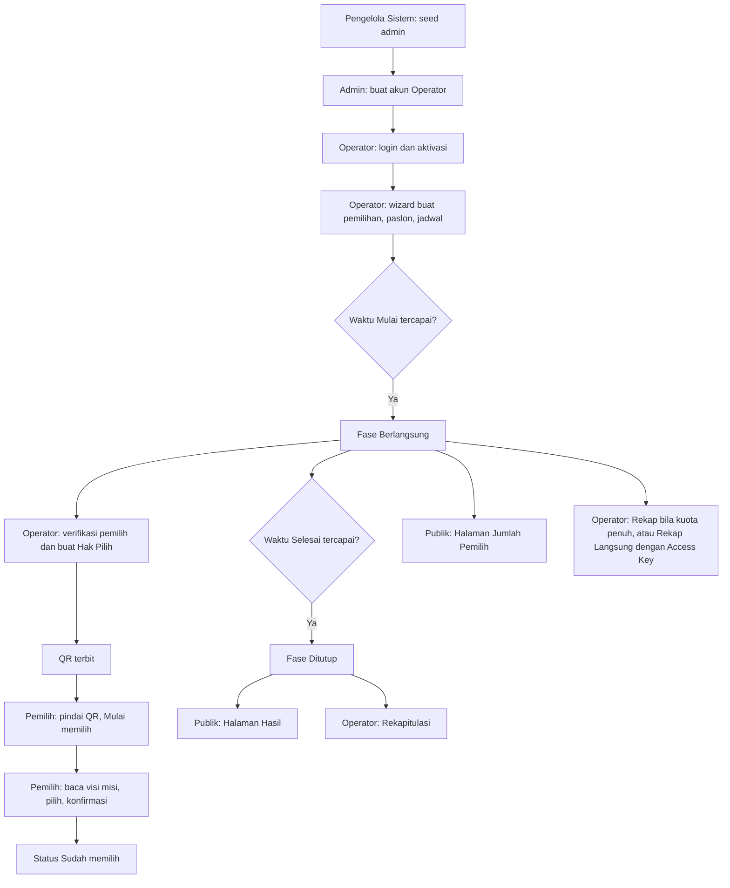
```mermaid
flowchart TD
  A["Pengelola Sistem: seed admin"] --> B["Admin: buat akun Operator"]
  B --> C["Operator: login dan aktivasi"]
  C --> D["Operator: wizard buat pemilihan, paslon, jadwal"]
  D --> F{"Waktu Mulai tercapai?"}
  F -->|"Ya"| G["Fase Berlangsung"]
  G --> H["Operator: verifikasi pemilih dan buat Hak Pilih"]
  H --> I["QR terbit"]
  I --> J["Pemilih: pindai QR, Mulai memilih"]
  J --> K["Pemilih: baca visi misi, pilih, konfirmasi"]
  K --> L["Status Sudah memilih"]
  G --> M{"Waktu Selesai tercapai?"}
  M -->|"Ya"| N["Fase Ditutup"]
  N --> P["Publik: Halaman Hasil"]
  G --> Q["Publik: Halaman Jumlah Pemilih"]
  G --> R["Operator: Rekap bila kuota penuh, atau Rekap Langsung dengan Access Key"]
  N --> O["Operator: Rekapitulasi"]
```

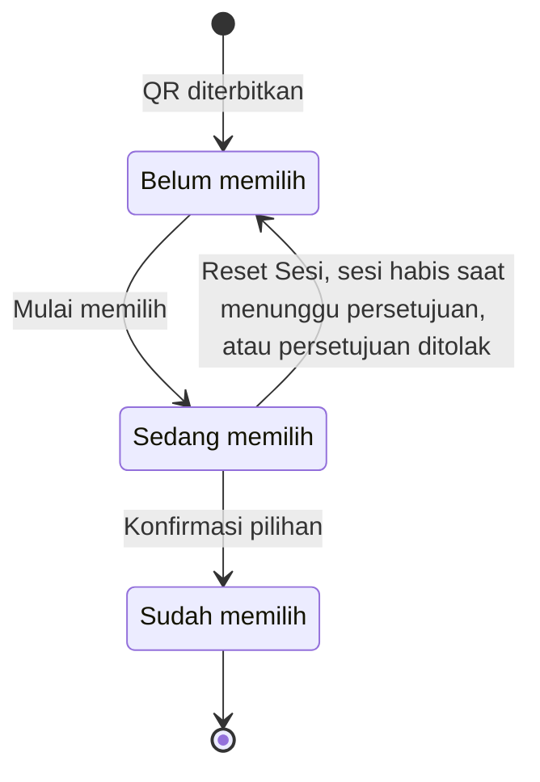
```mermaid
stateDiagram-v2
  state "Belum memilih" as BM
  state "Sedang memilih" as SM
  state "Sudah memilih" as SD
  [*] --> BM : QR diterbitkan
  BM --> SM : Mulai memilih
  SM --> SD : Konfirmasi pilihan
  SM --> BM : Reset Sesi, sesi habis saat menunggu persetujuan, atau persetujuan ditolak
  SD --> [*]
```

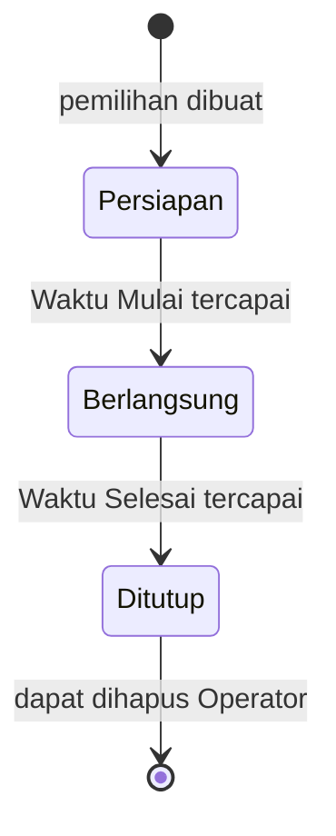
```mermaid
stateDiagram-v2
  state "Persiapan" as P
  state "Berlangsung" as B
  state "Ditutup" as D
  [*] --> P : pemilihan dibuat
  P --> B : Waktu Mulai tercapai
  B --> D : Waktu Selesai tercapai
  D --> [*] : dapat dihapus Operator
```

### WF-001 — Persiapan pemilihan (wizard)

`FR-008`, `FR-009`, `FR-011`, `FR-028`, `FR-035`.

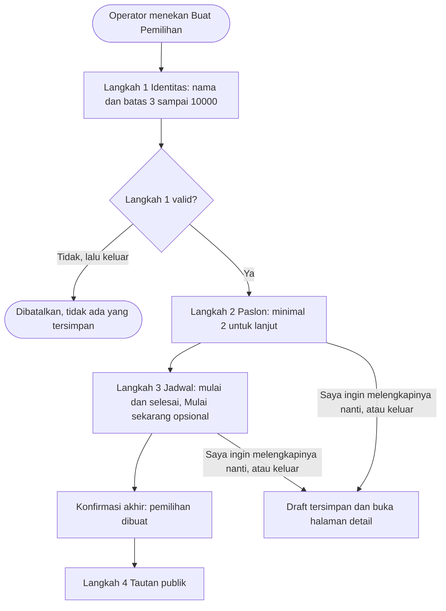
```mermaid
flowchart TD
  S(["Operator menekan Buat Pemilihan"]) --> A["Langkah 1 Identitas: nama dan batas 3 sampai 10000"]
  A --> V{"Langkah 1 valid?"}
  V -->|"Tidak, lalu keluar"| X(["Dibatalkan, tidak ada yang tersimpan"])
  V -->|"Ya"| B["Langkah 2 Paslon: minimal 2 untuk lanjut"]
  B --> C["Langkah 3 Jadwal: mulai dan selesai, Mulai sekarang opsional"]
  C --> D["Konfirmasi akhir: pemilihan dibuat"]
  D --> E["Langkah 4 Tautan publik"]
  B -->|"Saya ingin melengkapinya nanti, atau keluar"| DR["Draft tersimpan dan buka halaman detail"]
  C -->|"Saya ingin melengkapinya nanti, atau keluar"| DR
```

### WF-002 — Provisi dan pengelolaan akun staf

`FR-002`, `FR-005` – `FR-007`, `FR-027`, `FR-033`.

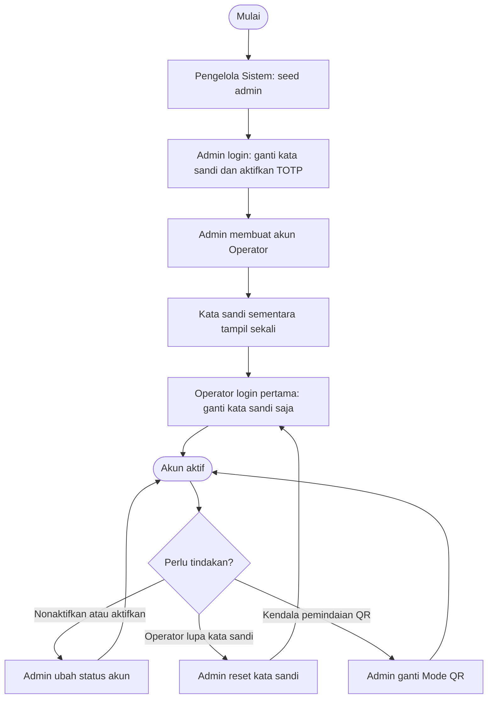
```mermaid
flowchart TD
  S(["Mulai"]) --> A["Pengelola Sistem: seed admin"]
  A --> B["Admin login: ganti kata sandi dan aktifkan TOTP"]
  B --> C["Admin membuat akun Operator"]
  C --> D["Kata sandi sementara tampil sekali"]
  D --> E["Operator login pertama: ganti kata sandi saja"]
  E --> F(["Akun aktif"])
  F --> G{"Perlu tindakan?"}
  G -->|"Nonaktifkan atau aktifkan"| H["Admin ubah status akun"]
  G -->|"Operator lupa kata sandi"| I["Admin reset kata sandi"]
  G -->|"Kendala pemindaian QR"| J["Admin ganti Mode QR"]
  I --> E
  H --> F
  J --> F
```

Operator juga dapat dibuat lewat CLI `seed:operator`. TOTP Admin yang hilang direset Pengelola Sistem.

### WF-003 — Login staf

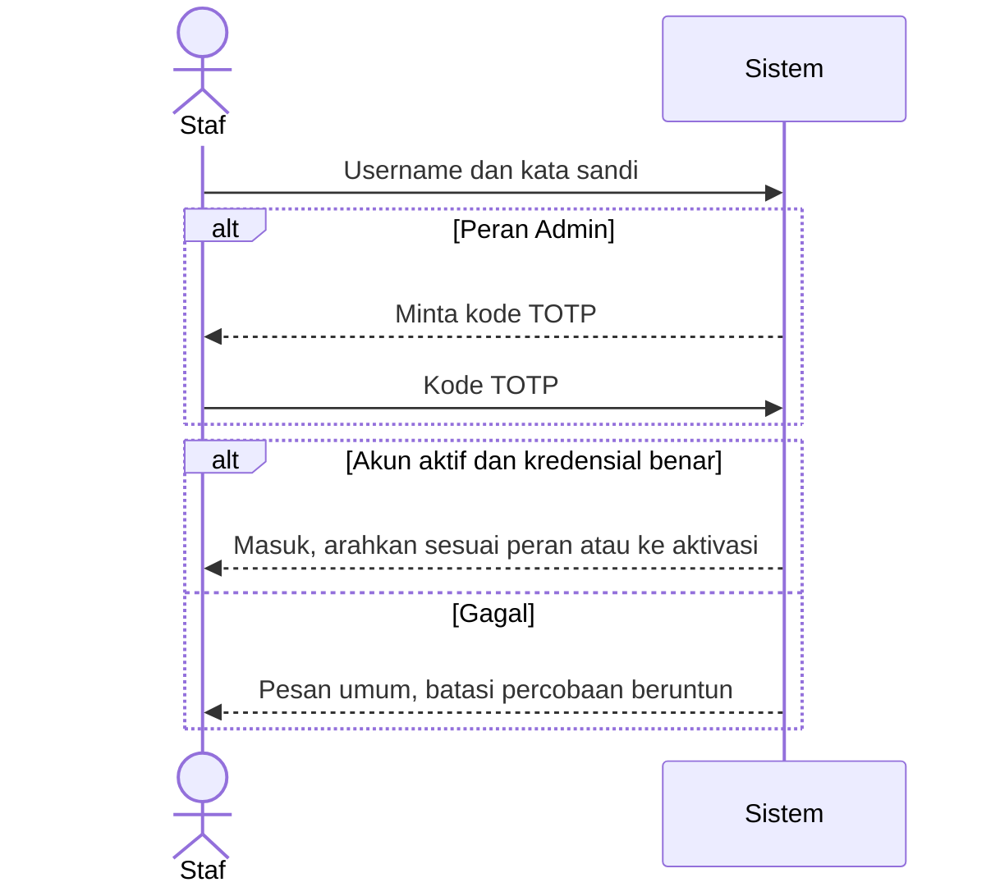
```mermaid
sequenceDiagram
  actor S as Staf
  participant X as Sistem
  S->>X: Username dan kata sandi
  alt Peran Admin
    X-->>S: Minta kode TOTP
    S->>X: Kode TOTP
  end
  alt Akun aktif dan kredensial benar
    X-->>S: Masuk, arahkan sesuai peran atau ke aktivasi
  else Gagal
    X-->>S: Pesan umum, batasi percobaan beruntun
  end
```

### WF-004 — Registrasi pemilih dan QR

`FR-012`, `FR-013`, `FR-014`, `FR-028`.

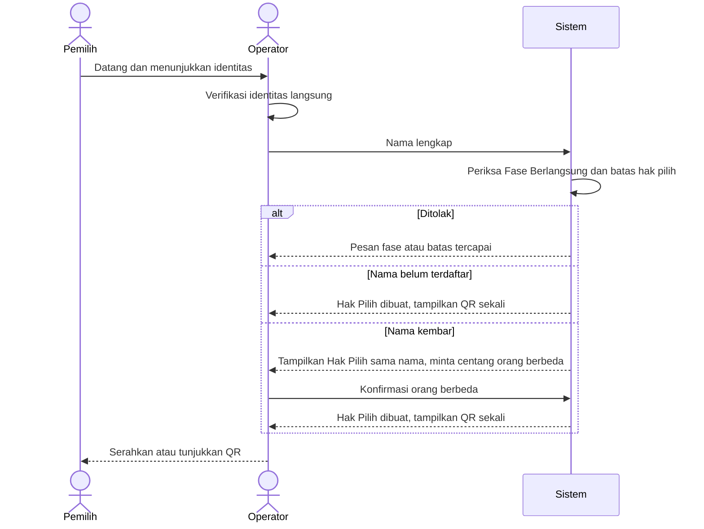
```mermaid
sequenceDiagram
  actor P as Pemilih
  actor O as Operator
  participant X as Sistem
  P->>O: Datang dan menunjukkan identitas
  O->>O: Verifikasi identitas langsung
  O->>X: Nama lengkap
  X->>X: Periksa Fase Berlangsung dan batas hak pilih
  alt Ditolak
    X-->>O: Pesan fase atau batas tercapai
  else Nama belum terdaftar
    X-->>O: Hak Pilih dibuat, tampilkan QR sekali
  else Nama kembar
    X-->>O: Tampilkan Hak Pilih sama nama, minta centang orang berbeda
    O->>X: Konfirmasi orang berbeda
    X-->>O: Hak Pilih dibuat, tampilkan QR sekali
  end
  O-->>P: Serahkan atau tunjukkan QR
```

### WF-005 — Voting oleh Pemilih

`FR-015` – `FR-019`, `FR-034`, `FR-043`.

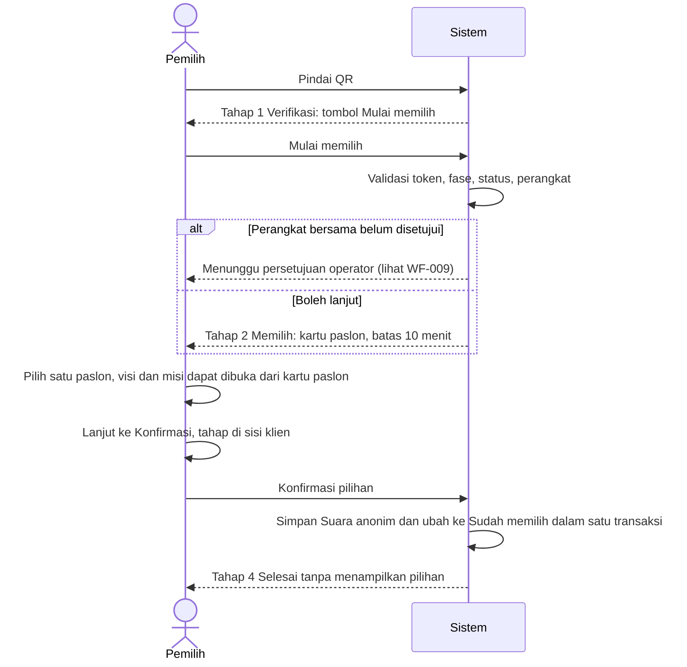
```mermaid
sequenceDiagram
  actor P as Pemilih
  participant X as Sistem
  P->>X: Pindai QR
  X-->>P: Tahap 1 Verifikasi: tombol Mulai memilih
  P->>X: Mulai memilih
  X->>X: Validasi token, fase, status, perangkat
  alt Perangkat bersama belum disetujui
    X-->>P: Menunggu persetujuan operator (lihat WF-009)
  else Boleh lanjut
    X-->>P: Tahap 2 Memilih: kartu paslon, batas 10 menit
  end
  P->>P: Pilih satu paslon, visi dan misi dapat dibuka dari kartu paslon
  P->>P: Lanjut ke Konfirmasi, tahap di sisi klien
  P->>X: Konfirmasi pilihan
  X->>X: Simpan Suara anonim dan ubah ke Sudah memilih dalam satu transaksi
  X-->>P: Tahap 4 Selesai tanpa menampilkan pilihan
```

### WF-006 — Voting terputus

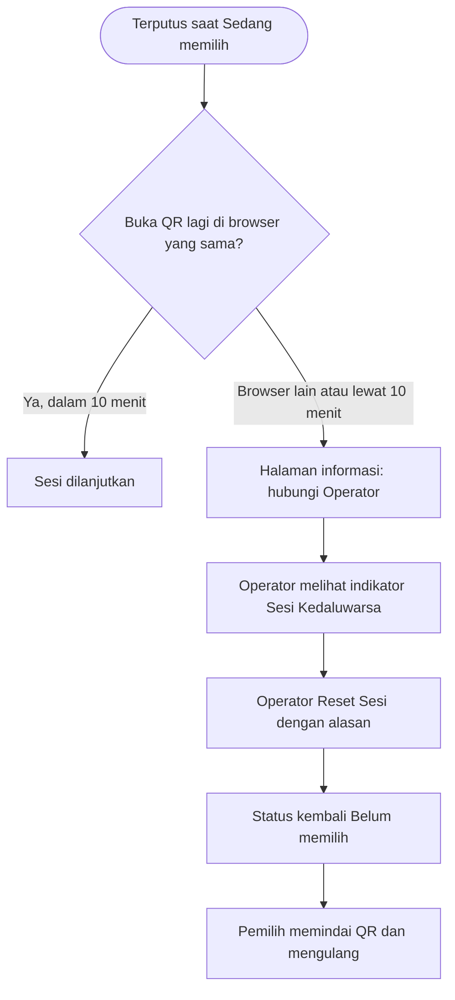
```mermaid
flowchart TD
  S(["Terputus saat Sedang memilih"]) --> A{"Buka QR lagi di browser yang sama?"}
  A -->|"Ya, dalam 10 menit"| B["Sesi dilanjutkan"]
  A -->|"Browser lain atau lewat 10 menit"| C["Halaman informasi: hubungi Operator"]
  C --> D["Operator melihat indikator Sesi Kedaluwarsa"]
  D --> E["Operator Reset Sesi dengan alasan"]
  E --> F["Status kembali Belum memilih"]
  F --> G["Pemilih memindai QR dan mengulang"]
```

### WF-007 — QR bermasalah

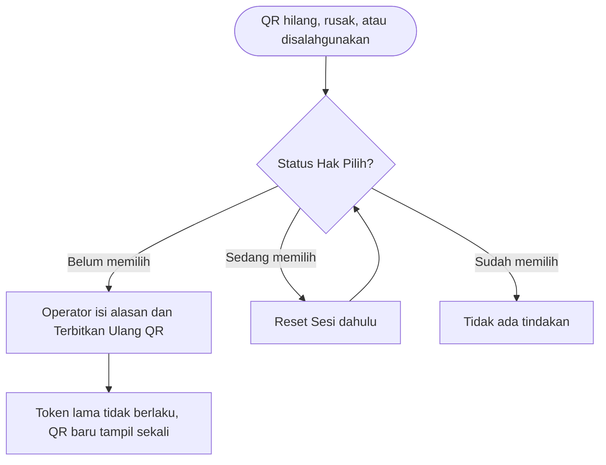
```mermaid
flowchart TD
  S(["QR hilang, rusak, atau disalahgunakan"]) --> A{"Status Hak Pilih?"}
  A -->|"Belum memilih"| C["Operator isi alasan dan Terbitkan Ulang QR"]
  C --> D["Token lama tidak berlaku, QR baru tampil sekali"]
  A -->|"Sedang memilih"| E["Reset Sesi dahulu"]
  E --> A
  A -->|"Sudah memilih"| F["Tidak ada tindakan"]
```

### WF-008 — Pemantauan, akhir masa, dan rekapitulasi

`FR-009`, `FR-020` – `FR-023`, `FR-032`, `FR-038`, `FR-039`.

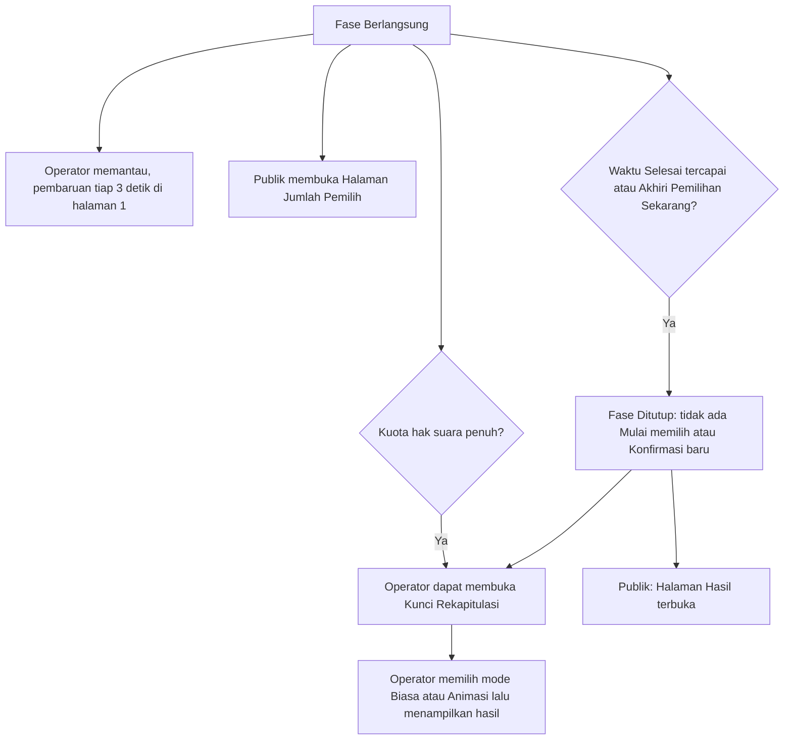
```mermaid
flowchart TD
  A["Fase Berlangsung"] --> B["Operator memantau, pembaruan tiap 3 detik di halaman 1"]
  A --> C["Publik membuka Halaman Jumlah Pemilih"]
  A --> D{"Kuota hak suara penuh?"}
  D -->|"Ya"| K["Operator dapat membuka Kunci Rekapitulasi"]
  A --> E{"Waktu Selesai tercapai atau Akhiri Pemilihan Sekarang?"}
  E -->|"Ya"| F["Fase Ditutup: tidak ada Mulai memilih atau Konfirmasi baru"]
  F --> K
  K --> G["Operator memilih mode Biasa atau Animasi lalu menampilkan hasil"]
  F --> H["Publik: Halaman Hasil terbuka"]
```

### WF-009 — Perangkat bersama: peringatan dan persetujuan

`FR-024`, `FR-025`, `FR-034`.

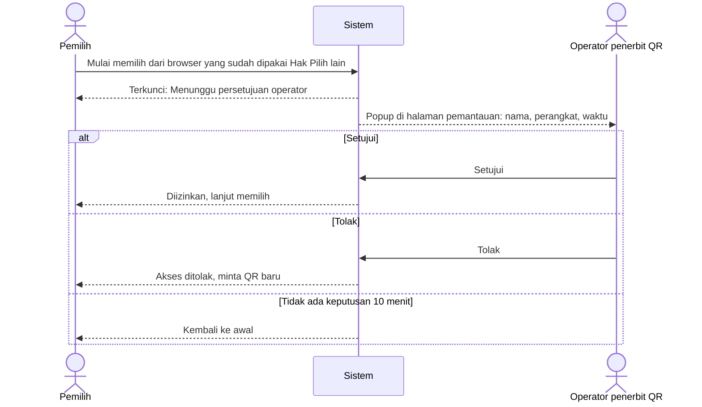
```mermaid
sequenceDiagram
  actor P as Pemilih
  participant X as Sistem
  actor O as Operator penerbit QR
  P->>X: Mulai memilih dari browser yang sudah dipakai Hak Pilih lain
  X-->>P: Terkunci: Menunggu persetujuan operator
  X-->>O: Popup di halaman pemantauan: nama, perangkat, waktu
  alt Setujui
    O->>X: Setujui
    X-->>P: Diizinkan, lanjut memilih
  else Tolak
    O->>X: Tolak
    X-->>P: Akses ditolak, minta QR baru
  else Tidak ada keputusan 10 menit
    X-->>P: Kembali ke awal
  end
```

### WF-010 — Hapus pemilihan

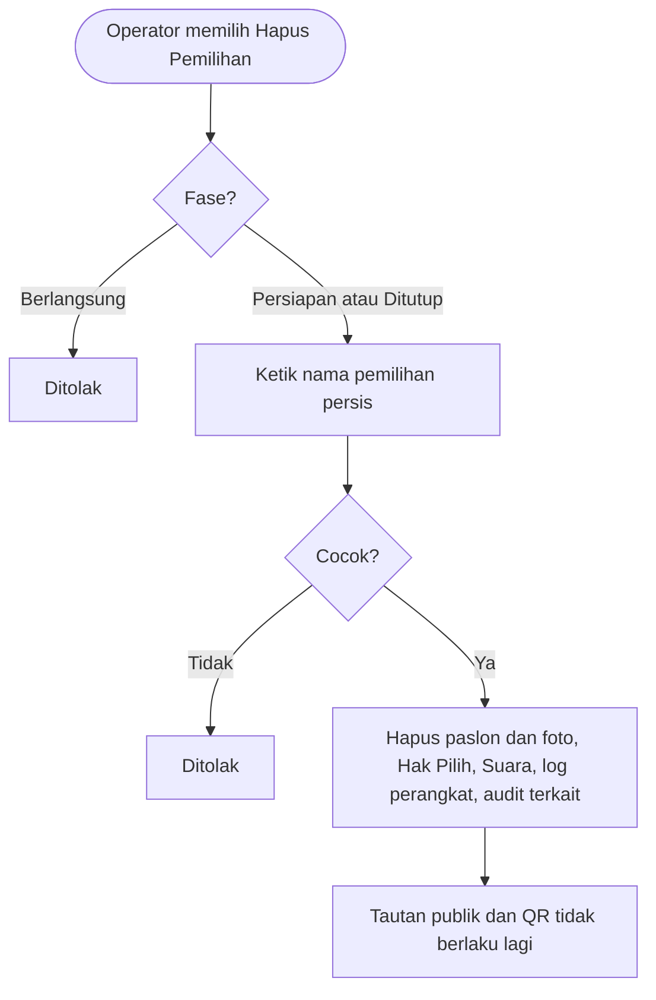
```mermaid
flowchart TD
  S(["Operator memilih Hapus Pemilihan"]) --> A{"Fase?"}
  A -->|"Berlangsung"| X["Ditolak"]
  A -->|"Persiapan atau Ditutup"| B["Ketik nama pemilihan persis"]
  B --> C{"Cocok?"}
  C -->|"Tidak"| X2["Ditolak"]
  C -->|"Ya"| D["Hapus paslon dan foto, Hak Pilih, Suara, log perangkat, audit terkait"]
  D --> E["Tautan publik dan QR tidak berlaku lagi"]
```

### WF-011 — Rekap Langsung dengan Access Key

`FR-037`.

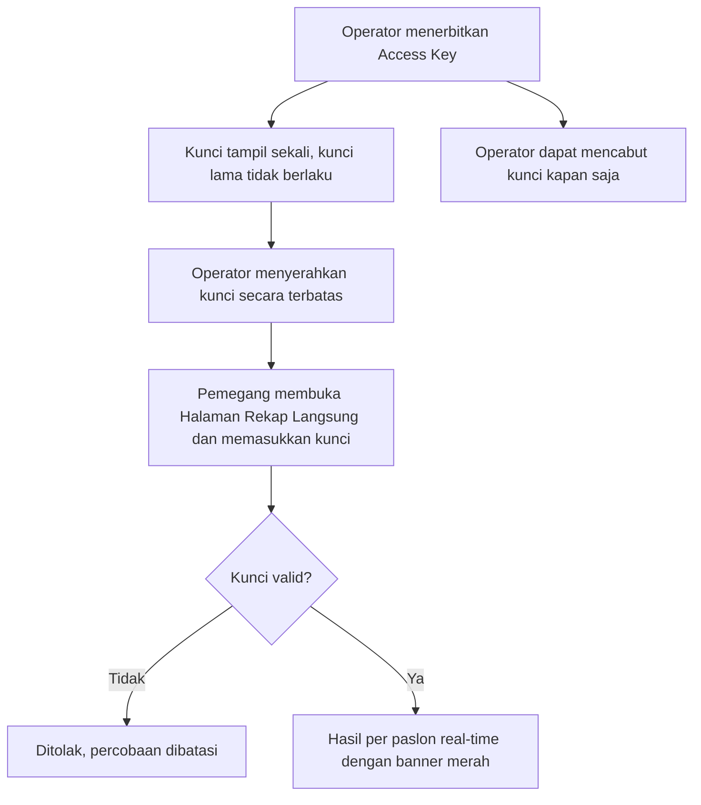
```mermaid
flowchart TD
  A["Operator menerbitkan Access Key"] --> B["Kunci tampil sekali, kunci lama tidak berlaku"]
  B --> C["Operator menyerahkan kunci secara terbatas"]
  C --> D["Pemegang membuka Halaman Rekap Langsung dan memasukkan kunci"]
  D --> E{"Kunci valid?"}
  E -->|"Tidak"| F["Ditolak, percobaan dibatasi"]
  E -->|"Ya"| G["Hasil per paslon real-time dengan banner merah"]
  A --> H["Operator dapat mencabut kunci kapan saja"]
```

### WF-012 — Batas penggunaan perangkat dan blokir Admin

`FR-043`, `FR-044`.

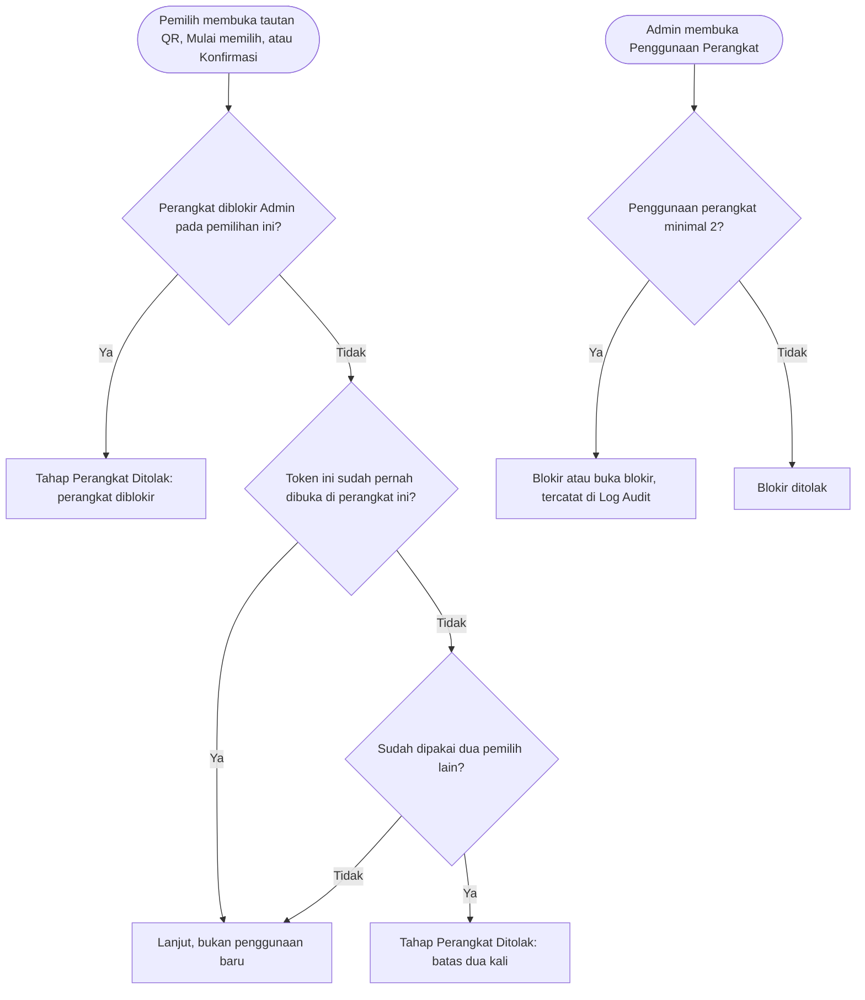
```mermaid
flowchart TD
  S(["Pemilih membuka tautan QR, Mulai memilih, atau Konfirmasi"]) --> A{"Perangkat diblokir Admin pada pemilihan ini?"}
  A -->|"Ya"| X["Tahap Perangkat Ditolak: perangkat diblokir"]
  A -->|"Tidak"| B{"Token ini sudah pernah dibuka di perangkat ini?"}
  B -->|"Ya"| OK["Lanjut, bukan penggunaan baru"]
  B -->|"Tidak"| C{"Sudah dipakai dua pemilih lain?"}
  C -->|"Ya"| X2["Tahap Perangkat Ditolak: batas dua kali"]
  C -->|"Tidak"| OK
  AD(["Admin membuka Penggunaan Perangkat"]) --> E{"Penggunaan perangkat minimal 2?"}
  E -->|"Ya"| F["Blokir atau buka blokir, tercatat di Log Audit"]
  E -->|"Tidak"| G["Blokir ditolak"]
```

## 3.6 UI/UX Conceptual Workflow

| ID | Halaman | Aktor | Tujuan | `FR` |
|---|---|---|---|---|
| UI-001 | Masuk | Admin, Operator | Username dan kata sandi (dapat ditampilkan) | FR-001, FR-003 |
| UI-002 | Verifikasi 2FA | Admin | Kode TOTP | FR-001 |
| UI-003 | Aktivasi Akun | Admin, Operator | Ganti kata sandi sementara; Admin juga aktivasi TOTP | FR-002 |
| UI-004 | Daftar Akun Operator dan Mode QR | Admin | Buat, aktif/nonaktif, reset kata sandi; pilih Mode QR | FR-005 – FR-007, FR-033 |
| UI-005 | Panel Buat Akun Operator | Admin | Isi data; kata sandi sementara tampil sekali | FR-005 |
| UI-006 | Log Audit | Admin | Tinjau dan filter | FR-026, FR-027 |
| UI-007 | Daftar Pemilihan dan Wizard | Operator | Lihat, buat (wizard), hapus pemilihan | FR-008, FR-035, FR-036 |
| UI-008 | Detail Pemilihan | Operator | Section bernomor dan dapat dilipat: 1 Identitas dan Hak Pilih, 2 Paslon, 3 Jadwal, 4 Tautan publik dan Access Key; hapus pemilihan | FR-008 – FR-011, FR-028, FR-036, FR-037 |
| UI-009 | Pantau Pemilih | Operator | Pantau status (25 per halaman, pembaruan 3 detik di halaman 1) | FR-023, FR-025, FR-034 |
| UI-010 | Panel Registrasi Pemilih | Operator | Isi nama; konfirmasi Nama Kembar | FR-012, FR-013 |
| UI-011 | Panel QR | Operator | QR dan tautan sekali tampil | FR-014, FR-029 |
| UI-012 | Panel Detail Hak Pilih | Operator | Riwayat perangkat, Reset Sesi, Terbitkan Ulang QR | FR-025, FR-029, FR-030 |
| UI-013 | Rekapitulasi | Operator | Kunci, mode Biasa/Animasi (Reveal Bertahap, Balapan) dengan halaman pengaturan dan pemutaran terpisah, integritas | FR-020, FR-032, FR-038, FR-039 |
| UI-014 | Pemilih — Tahap 1 Verifikasi | Pemilih | `Mulai memilih` | FR-015, FR-016 |
| UI-015 | Pemilih — Tahap 2 Memilih dan Tahap 3 Konfirmasi | Pemilih | Pilih paslon (visi-misi opsional), menunggu persetujuan, konfirmasi | FR-017, FR-018, FR-034 |
| UI-016 | Pemilih — Tahap 4 Selesai | Pemilih | Kepastian suara tersimpan | FR-018 |
| UI-017 | Pemilih — Informasi Kendala | Pemilih | Penyebab dan langkah berikutnya | FR-015 |
| UI-018 | Publik — Jumlah Pemilih | Publik | Satu angka | FR-021 |
| UI-019 | Publik — Hasil | Publik | Hasil setelah selesai | FR-022 |
| UI-020 | Halaman Galat Umum | Semua | 403, 404, 419, 429, 5xx | FR-004, FR-031 |
| UI-021 | Beranda | Semua | Alur penggunaan Operator dan Pemilih | FR-041 |
| UI-022 | Rekap Langsung | Publik | Masukkan Access Key, lihat hasil real-time | FR-037 |
| UI-023 | Popup Persetujuan Perangkat | Operator | Setujui/Tolak (pada `UI-009`) | FR-034 |
| UI-024 | Publik — Daftar Paslon | Publik | Melihat paslon (foto, visi, misi dalam dialog) dan memilih pemilihan | FR-042 |
| UI-025 | Admin — Penggunaan Perangkat | Admin | Melihat penggunaan perangkat per pemilihan; blokir dan buka blokir | FR-044 |
| UI-026 | Pemilih — Perangkat Ditolak | Pemilih | Memberi tahu bahwa perangkat diblokir atau batas dua kali tercapai (tanpa tombol konfirmasi; dapat ditutup) | FR-043 |

### Informasi, aksi, dan perubahan

| ID | Informasi | Aksi | Perubahan |
|---|---|---|---|
| UI-001/002 | Isian dan pesan galat umum | Masuk; verifikasi | Sesi staf dibuat |
| UI-003 | Ganti kata sandi; Admin: kunci TOTP dan kode konfirmasi | Simpan | Akun aktif |
| UI-004 | Daftar Operator (aktif, nama); panel Mode QR dengan pratinjau | Buat, nonaktif/aktif, reset kata sandi, ganti Mode QR | Akun/pengaturan berubah; audit |
| UI-006 | Entri audit (waktu, aktor, aksi, objek); filter aktor, aksi, kata kunci | Filter, halaman | — |
| UI-007 | Kartu pemilihan: nama, Fase, jadwal, jumlah Hak Pilih/batas, jumlah paslon | Buat (wizard), buka detail, hapus (ketik nama) | Pemilihan/draft dibuat atau dihapus |
| UI-008 | Nama, batas, daftar paslon (foto, visi, misi), jadwal, tautan publik, status Access Key | Simpan, tambah/ubah/hapus paslon, atur jadwal, Mulai sekarang, Akhiri sekarang, terbitkan/cabut Access Key, hapus pemilihan | Jadwal berubah → Fase mengikuti waktu |
| UI-009 | Ringkasan per status, perlu perhatian, integritas, tabel (nama, status, indikator, perangkat bersama dan anggotanya, status persetujuan), pencarian, filter, halaman | Registrasi baru, buka detail, Setujui/Tolak | — / persetujuan diputuskan |
| UI-010 | Isian nama; Hak Pilih sama nama | Buat; centang "orang berbeda" | Hak Pilih `Belum memilih` → `UI-011` |
| UI-011 | QR, tautan salin | Selesai | QR tidak dapat dibuka lagi |
| UI-012 | Status, sesi, riwayat akses, anggota Perangkat sama | Reset Sesi, Terbitkan Ulang QR (alasan wajib) | Status/token berubah |
| UI-013 | Kartu terkunci dan syarat; atau mode Biasa/Animasi dengan hasil, persentase, integritas | Buka/Tutup, pilih mode, atur urutan/delay, Mulai Animasi, Reset | `recap_open`, konfigurasi reveal tersimpan |
| UI-014 | Sambutan, nama pemilihan | `Mulai memilih` | `Belum memilih` → `Sedang memilih` |
| UI-015 | Kartu paslon (nomor, nama, foto), tombol `Pilih Paslon Ini`, `Lihat Visi & Misi` (dialog, opsional), sisa waktu, layar tunggu persetujuan dengan `Cek izin`; Tahap 3 menampilkan paslon terpilih | Pilih, buka visi-misi, `Lanjut ke Konfirmasi`, kembali, `Konfirmasi pilihan` | `Sedang memilih` → `Sudah memilih` |
| UI-016/017 | Pesan sukses (tanpa pilihan); pesan kendala | — | — |
| UI-018/019 | Nama pemilihan; angka atau hasil; waktu pemuatan | Muat ulang | — |
| UI-022 | Isian Access Key; hasil per paslon; banner merah | Verifikasi, kunci kembali | Sesi kunci |
| UI-023 | Nama pemilih, perangkat, waktu permintaan | Setujui, Tolak | Persetujuan `disetujui`/`ditolak` |
| UI-024 | Daftar pemilihan tercantum (bila lebih dari satu) atau kartu paslon: nomor, nama, foto (bila diizinkan), tombol visi-misi (dialog) | Pilih pemilihan, buka visi-misi | — |
| UI-025 | Pilihan pemilihan; tabel perangkat (Pengenal Browser, jumlah penggunaan, jumlah pembukaan, akses terakhir, User-Agent terakhir, status), 25 per halaman | Pilih pemilihan, Blokir (alasan opsional), Buka blokir | Blokir tercatat; audit |
| UI-026 | Judul "Batas Penggunaan Perangkat Tercapai" atau "Perangkat Ini Diblokir", penjelasan, langkah berikutnya | Tutup | Tidak ada |

| Kondisi | Aturan umum |
|---|---|
| Loading | Tombol terkunci sejak ditekan dan tidak aktif lagi kecuali aksi gagal; pembaruan berkala tidak menghilangkan isi |
| Kosong | Pesan kosong per daftar ("Belum ada ...") |
| Galat | Pesan Indonesia menyebut penyebab; isian dipertahankan; popup "Gagal" |
| Sukses | Popup 1–2 kata ("Berhasil", "Tersimpan", "Diizinkan") |

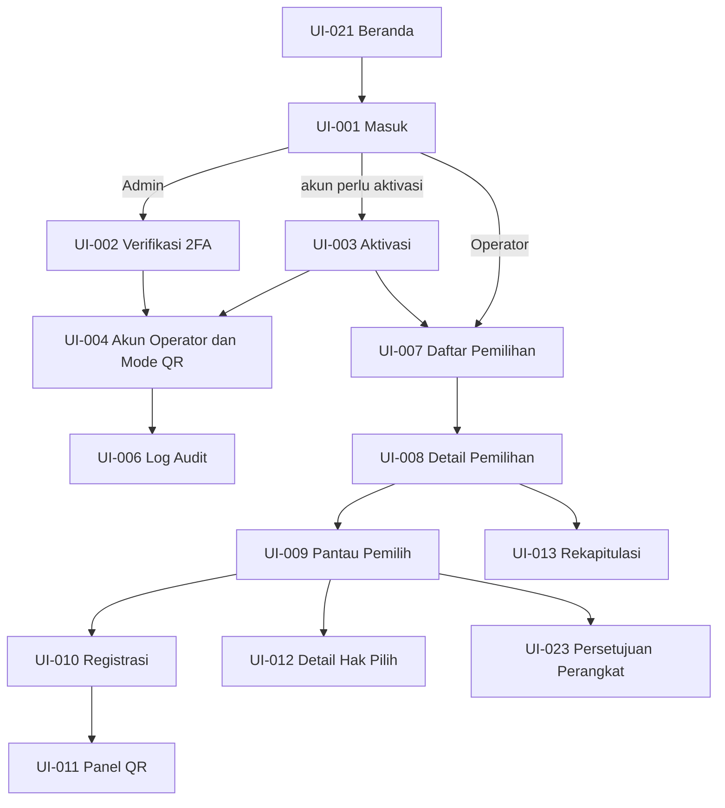
```mermaid
flowchart TD
  H["UI-021 Beranda"] --> L["UI-001 Masuk"]
  L -->|"Admin"| V["UI-002 Verifikasi 2FA"]
  L -->|"akun perlu aktivasi"| AK["UI-003 Aktivasi"]
  V --> A4["UI-004 Akun Operator dan Mode QR"]
  AK --> A4
  AK --> O7["UI-007 Daftar Pemilihan"]
  L -->|"Operator"| O7
  A4 --> A6["UI-006 Log Audit"]
  O7 --> O8["UI-008 Detail Pemilihan"]
  O8 --> O9["UI-009 Pantau Pemilih"]
  O9 --> O10["UI-010 Registrasi"]
  O10 --> O11["UI-011 Panel QR"]
  O9 --> O12["UI-012 Detail Hak Pilih"]
  O9 --> O23["UI-023 Persetujuan Perangkat"]
  O8 --> O13["UI-013 Rekapitulasi"]
```

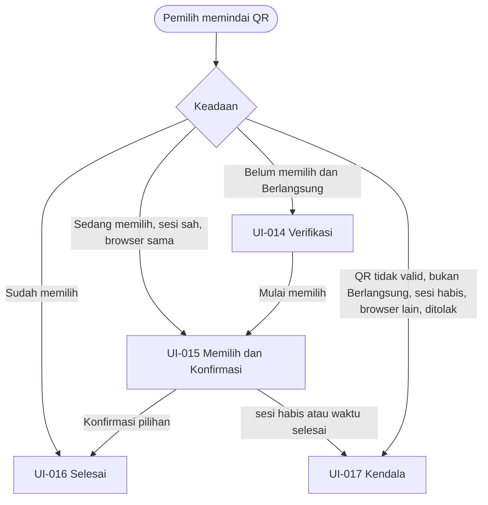
```mermaid
flowchart TD
  Q(["Pemilih memindai QR"]) --> S{"Keadaan"}
  S -->|"Belum memilih dan Berlangsung"| U14["UI-014 Verifikasi"]
  U14 -->|"Mulai memilih"| U15["UI-015 Memilih dan Konfirmasi"]
  S -->|"Sedang memilih, sesi sah, browser sama"| U15
  U15 -->|"Konfirmasi pilihan"| U16["UI-016 Selesai"]
  S -->|"Sudah memilih"| U16
  S -->|"QR tidak valid, bukan Berlangsung, sesi habis, browser lain, ditolak"| U17["UI-017 Kendala"]
  U15 -->|"sesi habis atau waktu selesai"| U17
```

## 3.7 Business Rules

| ID | Aturan | Dasar |
|---|---|---|
| BR-001 | Operator adalah validator identitas langsung; Hak Pilih dibuat setelah verifikasi. | `D§1` |
| BR-002 | Pemilih tanpa akun permanen; satu-satunya jalur akses adalah QR. | `D§1` |
| BR-003 | Satu Hak Pilih per pemilih per pemilihan; nama yang terdaftar dikunci. | `D§2` |
| BR-004 | Bila terdapat Nama Kembar, Operator harus memastikan semuanya orang berbeda sebelum Hak Pilih terpisah dibuat; jumlah nama kembar yang dikonfirmasi dicocokkan di basis data. | `D§2`, `KP-022` |
| BR-005 | Tidak ada kewajiban impor daftar pemilih atau integrasi data sekolah. | `D§2` |
| BR-006 | Status awal setelah QR terbit: `Belum memilih`. | `D§2` |
| BR-007 | Tiga status dan tiga transisi: `Belum memilih` → `Sedang memilih` (`Mulai memilih`); `Sedang memilih` → `Sudah memilih` (`Konfirmasi pilihan`); `Sedang memilih` → `Belum memilih` (Reset Sesi, sesi habis saat menunggu persetujuan, atau persetujuan ditolak). `Sudah memilih` final. | `D§4`, `KP-004`, `KP-014` |
| BR-008 | `Belum memilih` → `Sedang memilih` atomik: satu token tidak dapat memulai sesi dari beberapa perangkat serentak. | `D§4` |
| BR-009 | Suara dan status `Sudah memilih` tersimpan dalam satu transaksi. | `D§4` |
| BR-010 | Satu Hak Pilih/token menghasilkan satu Suara. | `D§3`, `D§9` |
| BR-011 | Pemilih memilih tepat satu paslon dari pemilihan itu. | `D§3` |
| BR-012 | Token QR acak, sulit ditebak, tanpa nama atau pilihan, dapat dicabut. | `D§3`, `D§9` |
| BR-013 | Sesi Memilih 10 menit; dapat dilanjutkan di browser yang sama; setelahnya hanya Operator (Reset Sesi). | `KP-004` |
| BR-014 | Reset Sesi: hanya Operator, hanya dari `Sedang memilih`, hanya saat `Berlangsung`, alasan wajib, tercatat. | `KP-004`, `D§6` |
| BR-015 | Data perangkat adalah indikator/audit; bukan identitas. Penggunaan satu perangkat oleh beberapa pemilih diperbolehkan **setelah persetujuan Operator** (`BR-034`) dan **sampai batas dua pemilih** (`BR-040`); di atas itu ditolak. (Penyimpangan dari `D§5`, lihat `CH-011`.) | `D§5`, `KP-025` |
| BR-016 | Identitas/Hak Pilih dipisahkan dari data pilihan; tidak ada hubungan data antara Hak Pilih dan Suara. | `D§7` |
| BR-017 | Operator melihat Status Hak Pilih tetapi tidak pilihan per pemilih. Hasil hanya dari Suara anonim dan hanya lewat jalur `BR-026`. | `D§7` |
| BR-018 | Batas maksimum Hak Pilih per pemilihan ditetapkan Operator, **3 sampai 10.000**; pembuatan ditolak setelah batas tercapai; batas tidak boleh di bawah jumlah Hak Pilih yang ada. | `D§8`, `CH-001`, `KP-019` |
| BR-019 | Jumlah Suara tidak melebihi Hak Pilih dan sama dengan jumlah `Sudah memilih`. | `D§8` |
| BR-020 | Log Audit tidak dapat diubah atau dihapus, kecuali entri yang terkait pemilihan yang dihapus (`BR-036`). | `D§6`, `CH-008` |
| BR-021 | Admin hanya mengelola akun Operator, Mode QR, dan meninjau Log Audit; Operator mengelola operasi pemilihan, bukan akun; Admin tidak mengakses data pemilihan. | `D§6`, `KP-005` |
| BR-022 | Akun staf wajib kata sandi; **Admin** wajib TOTP; Operator tanpa TOTP. | `D§6`, `KP-009` |
| BR-023 | Hak Pilih hanya dibuat, serta `Mulai memilih` dan `Konfirmasi pilihan` hanya diterima, pada Fase `Berlangsung`. | `KP-007` |
| BR-024 | Paslon hanya diubah pada Fase `Persiapan`; jadwal hanya dapat diatur bila paslon ≥ 2. | OD-007 |
| BR-025 | Jadwal: presisi menit; selesai > mulai; jadwal baru tidak boleh sudah berakhir; Waktu Mulai terkunci setelah `Berlangsung`; Waktu Selesai dapat diperpanjang/dimajukan; tidak dapat diubah setelah `Ditutup`. | `KP-007` |
| BR-026 | **Hasil per paslon di halaman publik hanya setelah Waktu Selesai.** Sebelum itu hasil hanya melalui dua jalur terkendali: (a) Rekapitulasi Operator yang dibuka Operator bila kuota hak suara penuh atau pemilihan `Ditutup` (`BR-038`); (b) Rekap Langsung dengan Access Key (`BR-035`). Seluruhnya agregat dan anonim. | `KP-008`, `KP-017`, `KP-018`, `CH-005` |
| BR-027 | Terbitkan Ulang QR hanya saat `Belum memilih` dan `Berlangsung`; mencabut token lama; alasan wajib. | `D§6`, `D§9` |
| BR-028 | Halaman Pemilih tidak menampilkan nama dan, setelah penyimpanan, tidak menampilkan pilihan. | `D§7` |
| BR-029 | Satu pemilih ≠ satu perangkat: pembatasan utama didasarkan pada Hak Pilih dan Token QR; pembatasan perangkat hanya lewat batas dua pemilih dan blokir Admin (`BR-040`, `BR-041`). | `D§5`, `KP-025` |
| BR-030 | Keputusan validasi dan otorisasi dilakukan di backend. | `D§9` |
| BR-031 | Halaman Jumlah Pemilih hanya satu angka total `Sudah memilih`; kapan saja; tanpa login. | `KP-008` |
| BR-032 | Waktu Selesai batas keras: setelahnya tidak ada `Mulai memilih` atau `Konfirmasi pilihan`, termasuk sesi berjalan; tidak dibuka kembali. | OD-006c |
| BR-033 | Mode QR diatur Admin, berlaku untuk QR yang digambar sesudahnya, tidak mengubah isi token, dicatat di audit. | `FR-033` |
| BR-034 | Perangkat bersama memerlukan persetujuan **Operator penerbit QR**. Tolak mencabut QR dan mengakhiri sesi; tanpa keputusan 10 menit sesi dikembalikan ke awal. Hak Pilih tanpa penerbit tercatat tidak dapat diputuskan siapa pun (harus Terbitkan Ulang QR). Keputusan hanya pada Fase `Berlangsung` dan dicatat. | `KP-014`, `CH-009` |
| BR-035 | Access Key: tepat 64 karakter acak; satu aktif per pemilihan; penerbitan baru mencabut yang lama; hanya hash tersimpan; tampil sekali; hanya baca; percobaan salah dibatasi; tidak ada tautan dari halaman publik. | `KP-017` |
| BR-036 | Hapus pemilihan hanya pada Fase `Persiapan`/`Ditutup`, dengan nama diketik persis; permanen; menghapus data terkait (paslon dan foto, Hak Pilih, Suara, log perangkat, entri audit terkait). | `KP-016`, `CH-008` |
| BR-037 | **Dicabut.** (Sebelumnya: `Lanjut ke Konfirmasi` ditolak bila ada visi-misi paslon belum dibuka.) ID tidak dipakai ulang. | `KP-026`, `CH-012` |
| BR-039 | Daftar Paslon Publik hanya mencantumkan pemilihan yang jadwalnya diatur dan memiliki paslon, tidak mencantumkan nama bertanda pelatihan/simulasi/tes, tidak menampilkan data pemilih atau hasil, dan menampilkan foto paslon hanya bila Operator mengizinkan. | `KP-024` |
| BR-040 | Satu perangkat hanya boleh dipakai **dua Hak Pilih berbeda** per pemilihan (resmi dan simulasi); membuka ulang token yang sama bukan penggunaan baru; QR ketiga ditolak saat dibuka tanpa menambah hitungan; ditegakkan di basis data pada pembukaan tautan, mulai memilih, pemeriksaan dan keputusan persetujuan, dan konfirmasi; hanya penggunaan sejak cutoff pemilihan yang dihitung. | `KP-025`, `KP-027` |
| BR-041 | Blokir manual perangkat hanya oleh Admin aktif, per pemilihan, dan hanya bila perangkat sudah dipakai dua kali; blokir dapat dibuka; keduanya dicatat; blokir terhapus bersama pemilihan. | `KP-025`, `CH-013` |
| BR-038 | Kunci Rekapitulasi default tertutup; dapat dibuka bila jumlah `Sudah memilih` ≥ batas maksimum atau Fase `Ditutup`; setelah itu buka/tutup bebas dan tersimpan. | `KP-018` |

## 3.8 Acceptance Criteria

| ID | Menguji | Kriteria |
|---|---|---|
| AC-001 | FR-001, BR-022 | **Given** Admin aktif ber-TOTP, **when** kata sandi dan TOTP benar, **then** masuk. Kata sandi benar tetapi TOTP salah → tidak masuk. **Given** Operator aktif, **when** kata sandi benar, **then** masuk tanpa TOTP. |
| AC-002 | FR-001, NFR-001 | Kredensial salah → pesan tidak membedakan username/kata sandi; setelah 5 percobaan dalam 60 detik, permintaan berikutnya ditolak sementara. |
| AC-003 | FR-002 | **Given** Admin baru/reset, **then** wajib ganti kata sandi dan aktifkan TOTP; **given** Operator baru/reset, **then** wajib ganti kata sandi saja; sebelum selesai halaman lain mengalihkan ke `UI-003`. |
| AC-004 | FR-003 | Keluar atau idle melebihi batas mengakhiri sesi. |
| AC-005 | FR-004, BR-021 | Operator ke fitur akun/Log Audit/Mode QR → ditolak; Admin ke data pemilihan → ditolak; tanpa login ke halaman staf → ke `UI-001`. |
| AC-006 | FR-005 | Admin membuat Operator dengan username unik → muncul di daftar, kata sandi sementara tampil sekali; username ganda ditolak. |
| AC-007 | FR-006 | Akun dinonaktifkan → permintaan berikutnya dari sesi itu dan login baru ditolak; akun tetap ada; aktif kembali berfungsi. |
| AC-008 | FR-007 | Reset kata sandi Operator → kata sandi sementara baru tampil sekali dan wajib diganti. |
| AC-009 | FR-008, BR-018 | Nama valid dan batas 3–10.000 → pemilihan `Persiapan`; batas < 3, > 10.000, atau < jumlah Hak Pilih → ditolak. |
| AC-010 | FR-009, BR-024, BR-025 | Jadwal valid dengan paslon ≥ 2 → tersimpan; selesai ≤ mulai, jadwal sudah berakhir, atau paslon < 2 → ditolak. |
| AC-011 | FR-009, BR-025 | `Berlangsung`: perpanjang selesai OK; ubah mulai ditolak; **Akhiri Pemilihan Sekarang** → `Ditutup`. `Ditutup`: ubah jadwal ditolak. |
| AC-012 | FR-010, BR-023, BR-032 | Di luar `Berlangsung`, registrasi, `Mulai memilih`, dan `Konfirmasi pilihan` ditolak; fase berubah otomatis pada Waktu Mulai/Selesai. |
| AC-013 | FR-011, BR-024 | `Persiapan`: tambah paslon (nomor unik, foto JPG/PNG/WEBP ≤ 2 MB); `Berlangsung`/`Ditutup`: ubah ditolak; paslon < 2 setelah jadwal diatur ditolak. |
| AC-014 | FR-012, BR-006 | `Berlangsung` + nama valid → Hak Pilih `Belum memilih` dan QR tampil. |
| AC-015 | FR-013 | Nama sudah terdaftar → tidak ada Hak Pilih baru sampai Operator mencentang "orang berbeda"; jumlah konfirmasi yang tidak sesuai ditolak oleh basis data; permintaan registrasi yang diulang dengan pengenal sama dijawab "sudah diproses" tanpa membuat Hak Pilih baru. |
| AC-016 | FR-014, BR-012, BR-028 | QR dan tautan tampil; tidak memuat nama/pilihan; setelah panel ditutup QR tidak dapat ditampilkan lagi. |
| AC-017 | FR-015, BR-028 | QR valid → halaman sesuai keadaan; token tidak dikenal atau sudah diganti → `UI-017` seragam; nama tidak tampil. |
| AC-018 | FR-016, BR-008 | `Belum memilih` + `Berlangsung` + `Mulai memilih` → `Sedang memilih`; dua perangkat serentak pada satu token → tepat satu berhasil. |
| AC-019 | FR-017, BR-011 | `Pilih Paslon Ini` atau ketuk kartu memilih satu paslon; `Lanjut ke Konfirmasi` tanpa pilihan tidak dapat dilanjutkan; dengan satu paslon terpilih langsung ke tahap Konfirmasi (tanpa syarat membuka visi-misi); `Lihat Visi & Misi` membuka dialog. |
| AC-020 | FR-018, BR-009, BR-010 | `Konfirmasi pilihan` → satu Suara, `Sudah memilih`, `UI-016` tanpa pilihan; konfirmasi ulang tidak menambah Suara. |
| AC-021 | FR-018 | Konfirmasi gagal di tengah proses → tidak ada Suara dan status tetap `Sedang memilih`. |
| AC-022 | FR-019, BR-007 | Transisi di luar yang diizinkan ditolak (mis. dari `Sudah memilih`). |
| AC-023 | FR-020, FR-038, BR-038 | Rekap default terkunci dan menjelaskan syarat; kuota penuh atau `Ditutup` → dapat dibuka; Operator dapat menutup dan membuka kembali; keadaan sama bagi semua Operator. |
| AC-024 | FR-021, BR-031 | Tanpa login, kapan saja: nama pemilihan dan satu angka `Sudah memilih`; muat ulang manual memperbarui; tidak ada nama/rincian paslon. |
| AC-025 | FR-022, BR-026 | Sebelum Waktu Selesai: "belum tersedia" tanpa angka; sesudahnya: hasil per paslon dan total. |
| AC-026 | FR-023, NFR-016 | Perubahan status tampil ≤ 3 detik di halaman 1 tanpa refresh; halaman 2+ dan saat panel terbuka tidak memperbarui diri; Operator tidak melihat pilihan. |
| AC-027 | FR-024 | Setiap pembukaan QR, mulai, dan konfirmasi tercatat jenis akses, Pengenal Browser, User-Agent, IP, waktu; tanpa pilihan. |
| AC-028 | FR-025, BR-015 | Browser yang sama dipakai Hak Pilih A lalu B → keduanya ditandai Peringatan Perangkat dengan daftar anggota; IP sama saja tidak menandai. |
| AC-029 | FR-026, BR-020 | Tindakan pada `FR-026` meninggalkan entri audit tanpa isi pilihan; entri tidak dapat diubah. |
| AC-030 | FR-027 | Admin melihat dan memfilter Log Audit; Operator ditolak. |
| AC-031 | FR-028, BR-018 | Hak Pilih ke-(batas+1) ditolak; setelah batas dinaikkan berhasil. |
| AC-032 | FR-029, BR-027 | `Belum memilih` + `Berlangsung` + alasan → QR lama tidak berlaku, QR baru tampil sekali; `Sedang memilih` atau tanpa alasan → ditolak. |
| AC-033 | FR-030, BR-014 | `Sedang memilih` + alasan → `Belum memilih`; sesi lama tidak dapat mengonfirmasi; tercatat. |
| AC-034 | BR-013 | Browser sama < 10 menit → lanjut; lewat 10 menit atau browser lain → `UI-017`; indikator Sesi Kedaluwarsa tampil. |
| AC-035 | FR-031, NFR-012 | Tombol terkunci sejak ditekan; popup 1–2 kata; mengklik pembuatan pemilihan 10 kali menghasilkan satu pemilihan. |
| AC-036 | FR-032, BR-019 | Operator melihat Suara, `Sudah memilih`, dan penanda konsisten. |
| AC-037 | BR-016, BR-017, NFR-005 | Tidak ada layar, ekspor, atau data bagi Admin/Operator/Rekap Langsung yang menghubungkan pemilih dengan pilihannya. |
| AC-038 | BR-029, BR-034 | Dua pemilih berbeda memakai satu browser: yang kedua menunggu persetujuan; setelah disetujui dapat memilih. |
| AC-039 | BR-032 | `Sedang memilih` saat Waktu Selesai → `Konfirmasi pilihan` ditolak, tanpa Suara. |
| AC-040 | NFR-007 | Permintaan serentak pada satu token → paling banyak satu sesi dan satu Suara. |
| AC-041 | FR-033, BR-033 | Admin mengganti Mode QR → QR berikutnya mengikuti mode; token tak berubah; tercatat. |
| AC-042 | FR-034, BR-034 | Perangkat bersama: Pemilih terkunci "Menunggu persetujuan operator"; popup hanya di Operator penerbit; Setujui → lanjut; Tolak → pesan penolakan, QR lama tidak berlaku. |
| AC-043 | FR-034 | Operator lain mencoba memutuskan permintaan Operator penerbit → ditolak, status tidak berubah; Hak Pilih tanpa penerbit tidak dapat diputuskan; tanpa keputusan 10 menit → kembali ke awal. |
| AC-044 | FR-035 | Wizard langkah 1 kosong lalu keluar → tidak ada pemilihan; langkah 1 terisi lalu keluar atau "Saya ingin melengkapinya nanti" → draft tersimpan dan halaman detail terbuka. |
| AC-045 | FR-035 | Langkah Paslon tidak dapat dilanjutkan dengan < 2 paslon; "Mulai sekarang" meminta konfirmasi tambahan. |
| AC-046 | FR-036, BR-036 | `Berlangsung` → hapus ditolak; nama salah → ditolak; `Persiapan`/`Ditutup` + nama benar → pemilihan dan data terkait terhapus; tautan publik menampilkan "tidak ditemukan"; QR tak berlaku. |
| AC-047 | FR-037, BR-035 | Penerbitan menghasilkan 64 karakter tampil sekali; kunci lama ditolak; kunci salah ditolak dan dibatasi; kunci benar menampilkan hasil real-time dengan banner merah tanpa identitas. |
| AC-048 | FR-037 | Mencabut kunci → pemegang tidak dapat membuka atau melanjutkan melihat hasil. |
| AC-049 | FR-038 | Syarat kuota/Ditutup tidak terpenuhi → tombol buka ditolak dengan penjelasan. |
| AC-050 | FR-039 | Delay di luar 20–10.000 ms ditolak; Reveal Bertahap dan Balapan menyimpan pengaturan lalu membuka halaman pemutaran terpisah; membuka halaman pemutaran tanpa pengaturan atau tanpa Kunci Rekapitulasi terbuka mengalihkan ke halaman pengaturan; Balapan manual menambah satu suara per klik; angka dan persentase sesuai data. |
| AC-051 | FR-040 | **Dicabut** (gerbang visi-misi dicabut, `CH-012`). |
| AC-052 | FR-041 | Beranda menampilkan alur Operator dan alur Pemilih. |
| AC-053 | FR-042, BR-039 | Tanpa login, halaman daftar paslon menampilkan paslon pemilihan yang berjadwal dan berpaslon; pemilihan bernama pelatihan/simulasi/tes tidak muncul; foto yang disembunyikan Operator tidak tampil; tidak ada data pemilih atau hasil. |
| AC-054 | FR-043, BR-040 | Dua pemilih berbeda membuka tautan di perangkat yang sama → keduanya lolos (yang kedua memerlukan persetujuan Operator penerbit saat `Mulai memilih`); QR ketiga ditolak **saat dibuka** tanpa menambah hitungan, membuka sesi, atau mengajukan persetujuan; refresh QR yang sama tetap satu penggunaan; token tersebut tetap dapat dibuka di browser lain yang punya jatah; Operator penerbit melihat banner dan label merah **Batas perangkat tercapai**, yang hilang setelah QR dibuka berhasil di browser lain. |
| AC-055 | FR-044, BR-041 | Admin memblokir perangkat yang belum dipakai dua kali → ditolak; perangkat yang sudah dua kali dapat diblokir; perangkat diblokir ditolak pada tautan, mulai, dan konfirmasi; buka blokir memulihkan akses; tercatat di Log Audit. |
| AC-056 | FR-044, UI-025 | Halaman Penggunaan Perangkat hanya untuk Admin; tidak menampilkan nama pemilih atau pilihan; Operator ditolak. |

---

# 4. Status Implementasi (per commit `4e31fb2`)

Status dari **membaca kode**; tidak ada eksekusi aplikasi atau tes oleh penyusun. "Tes" menyebut metode pada `tests/Feature/EvotingSystemTest.php` dan `tests/Feature/HardeningTest.php` yang menyentuh area itu (tidak berarti lulus). Rincian `GAP` ada di `BLUEPRINT.md` Bagian 4.

| FR | Status | Catatan |
|---|---|---|
| FR-001 – FR-003 | Terimplementasi | Tes: `admin_requires_totp...`, `first_login_activation...`. TOTP buatan sendiri tanpa kode pemulihan (`GAP-014`). Sesi staf berversi (invalid setelah reset/nonaktif) |
| FR-004 | Terimplementasi | Middleware rute, **pemeriksaan ulang pada setiap permintaan Livewire** (kelas dasar `StaffPage` + Gate), middleware persisten Livewire. Tes: `role_isolation...`, `staff_page_refreshes_authorization...`, `operator_reset_revokes...` |
| FR-005 – FR-007 | Terimplementasi | — |
| FR-008, FR-009 | Terimplementasi | Aturan jadwal di fungsi basis data; rentang batas 3–10.000 di aplikasi (`GAP-006`) |
| FR-010 | Terimplementasi | Fase dihitung di basis data |
| FR-011 | Sebagian | Penguncian ke `Persiapan` hanya di aplikasi (`GAP-006`). Tes: unggah foto |
| FR-035 | Terimplementasi | Tes: `update_v1_features...` |
| FR-036 | Terimplementasi dengan penyimpangan | Juga menghapus Suara dan audit terkait (`GAP-003`, OD-016). Fungsi kini memeriksa Operator aktif |
| FR-012, FR-013 | Terimplementasi | Idempotensi dan penjaga Nama Kembar di basis data. Tes: `registration_request_and_confirmed_name_count...` |
| FR-014, FR-029 | Terimplementasi | QR lama menjadi "tidak valid" (`GAP-012`) |
| FR-015 – FR-019 | Terimplementasi | Tes: `full_election_lifecycle...` |
| FR-034 | Terimplementasi | Hak Pilih tanpa penerbit tidak dapat diputuskan (`CH-009`, `GAP-017`) |
| FR-040 | Dicabut | Gerbang dihapus pada commit `fac2b91` (tanpa `proceedToConfirm`; `confirmVote` tidak lagi menerima daftar paslon terbaca) |
| FR-020, FR-038, FR-039 | Terimplementasi | Gerbang rekap (buka bila kuota penuh atau `Ditutup`, dan `recap_open`) kini juga di `fn_operator_election_results`. Tes: `update_v5...` |
| FR-021, FR-022 | Terimplementasi | Hasil publik digerbangi di basis data |
| FR-037 | Terimplementasi | Access Key dimasukkan lewat form (bukan di URL) |
| FR-023 | Terimplementasi | Interval 3 detik tertulis di Blade; konfigurasi `operator_poll_seconds` tidak dipakai (`GAP-002`) |
| FR-024, FR-025 | Terimplementasi | Peringatan simetris (`GAP-016`) |
| FR-026, FR-027 | Terimplementasi | Kosakata aksi bebas; detail log memuat username yang diketik dan nama pemilih (`GAP-013`) |
| FR-028 | Sebagian | Batas saat registrasi ditegakkan di fungsi; penurunan batas hanya di aplikasi (`GAP-006`) |
| FR-030 | Terimplementasi | — |
| FR-031 | Terimplementasi | Kunci idempoten dan insiden galat basis data bernomor |
| FR-032 | Terimplementasi | — |
| FR-033 | Terimplementasi | Tes: `qr_custom_logo_mode...` |
| FR-041 | Terimplementasi | — |
| FR-042 | Terimplementasi | Daftar publik tanpa pembatasan Fase; penyaring nama pelatihan/simulasi/tes memakai ekspresi reguler pada nama pemilihan. Tes: `EvotingSystemTest` diperluas pada commit ini (tidak ditelusuri baris demi baris) |

Pengerasan keamanan 25–26 November (`KP-028`, `NFR-017`) terbaca di kode dan dokumen `docs/security/`; audit internal `docs/security/AUDIT-2026-11.md` masih melaporkan temuan terbuka seperti tingkat patch PHP-FPM produksi dan TLS basis data (`GAP-022`).

Catatan keamanan (`GAP-001`): kata sandi lama role basis data sempat tertulis di `schema.sql` yang dipublikasikan (diganti placeholder pada commit `4bd8985`). Audit internal menyatakan pemilik telah mengonfirmasi rotasi; riwayat Git lokal masih memuat versi lama, sehingga tetap perlu dipastikan bahwa kredensial lama sudah tidak berlaku.

*Akhir PRD. Pemetaan teknis tiap kebutuhan ada di `BLUEPRINT.md` Bagian 3.17.*
